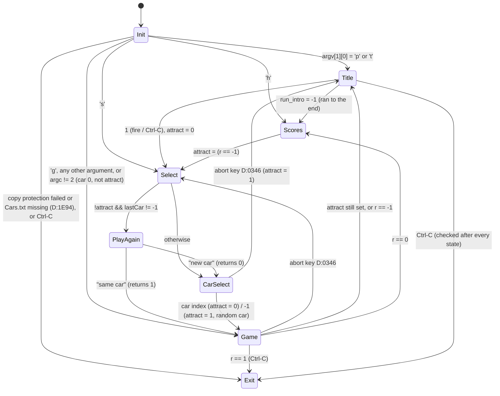

# game_flow — Test Drive (Amiga) `td`: program flow, high scores, stage results, drive-level flow

Porting spec for the Amiga game logic outside the platform layer: the Aztec startup and `main` (screen state
machine and overlay switching), `Cars.txt`, the HighScores file, name entry, score table and credits, the gas
station and results text, and in overlay 2 the drive-level flow: `run_game` (stages, lives, per-frame driver
loop, stage end, crash, game over), stage scoring, stage loading/unloading, the Road Drawer task wrapper and its
"Pulling into ..." message, the ending and the play-again menu.

Conventions: `port/RE_GUIDE.md` and `port/amiga/README.md`. Functions are named by image address (td image, base
0x10000). Globals are `D:xxxx` = offset into the data hunk (A4-relative displacement d = `D:(0x7FFE + d)`). `int`
is 16 bits (Aztec C), `long` 32 bits, big-endian. `tick_count` (D:03D8) is the VBL counter, 60 Hz: the port runs
the NTSC rates (port/amiga/README.md, *Decisions* 1); durations in seconds below are VBL counts / 60, except dos
`Delay(n)`, which is n/50 s. `g_original_bugs` is the port's `--original-bugs` flag (not an Amiga global): its
branch is the original behaviour, the other the default fix (README, *Original bugs*; this spec owns bugs 4 and
11).

Sources: the annotated disassembly (`python tools/amigaidx.py work/amiga/disk/td dis <addr> <len>`; the dumps
used are kept in `work/amiga/scratch/game_flow/dis.txt`) and the Ghidra output `port/amiga/decomp/td.c`. Ghidra
drops or splits many stack arguments of Aztec calls, so **every call, argument order and constant below was read
from the disassembly**; td.c was used only as a reading aid. DOS references are to `port/spec/game_flow.md`
("DOS §x") and the merged `port/symbols.csv`. Names used for functions owned by other Amiga specs come from
`title_select_symbols.csv` and `platform_audio_symbols.csv`; names for drive_sim/drive_scene/platform_video
functions are provisional (those specs are not written yet).

---

## 1. Overview

The executable is Aztec C. The load-file entry `bra`s to the startup at **0x163B0**, which sets A4 = 0x1FC0E,
clears the BSS (D:1E94 upward, 0x504 longs), saves SysBase at D:27DC, opens dos.library and calls the Aztec
`_main` **0x1642A**. `_main` allocates the stdio table, parses the CLI command line into `argc`/`argv`
(D:27F4/D:27F0; from Workbench `argc` stays 0) and calls **`main` 0x10018**, then `exit(0)`.

`main` initialises the machine (task priority, pr_WindowPtr = −1, libraries, display, VBL tick server, input,
sound effects, copy-protection check, song player, sprites off), reads `Cars.txt`, and then runs a state machine
of `goto`s like the DOS `main`:

* **TITLE**: song TestDrive, overlay 1 `run_intro` (title_select). Ran to the end → **SCORES**; interrupted →
  **SELECT**.
* **SCORES**: song TestDrive, `high_scores` 0x12F28: load/verify `HighScores`, name entry if the last game
  qualifies, the "Test Drive Top Scores" table, save if changed, then the credits page if no car has been
  chosen yet (or in attract mode). Timeout → attract mode on. Then **SELECT**.
* **SELECT**: if a car was already played and we are not in attract mode, the **play-again menu** 0x1D5C8
  ("Play again with the same car" / "Select a new car"). Otherwise (or "new car") song Test2, reload `Cars.txt`
  and overlay 1 `car_select`. A car-select timeout turns attract mode on and picks a random car.
* **GAME**: unload overlay 1, then overlay 2 `run_game` 0x1C900 (all stages), unload overlay 2. Result 0 →
  **SCORES**; −1 or attract → **TITLE**; the abort key (D:0346) → **SELECT**.
* **Ctrl-C** (`quit_requested`, sticky) is checked after every screen and leaves the loop; there is no
  "BACK TO DOS" prompt. Shutdown undoes the initialisation.

The drive (`run_game`, overlay 2) is a two-task design, unlike DOS:

* The **main task** (priority raised to 4) runs the game logic once per **drive frame of at least 5 VBL** (12 Hz at
  the 60 Hz NTSC VBL): input, physics, traffic, police, road position, stage-end and crash tests, and the stage
  time (counted in drive frames; 12 frames = one displayed "second").
* The **Road Drawer** exec task (priority −1, created by `start_road_drawer` 0x24E94 in `stage_load`) renders
  the road and cockpit into the hidden view and flips (`show_view`) as fast as it can, one `WaitTOF` per frame.
  It also prints "Pulling into the gas station..." / "Pulling into the dealership..." while the car is near the
  end of the stage. The main task pauses it through D:24AE/D:2844.

Between stages the gas station (0x147E4) shows `<car>Gas` with the stage's sign and scrolls the results text
(0x1444C) in a 2-line window at the bottom. After stage 5 (index 4) the ending (0x1CF76) shows `pics/EndGame`
above the cockpit and then the glove-box note.

### Call graph

```
0x163B0 aztec_startup ── 0x1642A _main ── main 0x10018
main 0x10018
 ├─ init: 0x117E8 set_task_pri, 0x11554 open_libs, 0x1032C close_cli_window ('p' arg), 0x115BC display_init,
 │        0x1180E vbl_install, 0x154E4 input_init, 0x12304 sfx_init, 0x10588 copy_protection_check, 0x1278C song_init,
 │        0x153CC, 0x1042E blitter_pri_save
 ├─ load_cars_txt 0x10346 ── skip_line 0x10402
 ├─ song_play_testdrive 0x12E12 / song_play_test2 0x12E58 / song_stop 0x12DB0   [platform_audio]
 ├─ run_intro 0x1AED0, car_select 0x1B8E6                                          [title_select, overlay 1]
 ├─ high_scores 0x12F28
 │   ├─ hs_gfx_init 0x13250 / hs_gfx_free 0x132E6
 │   ├─ scores_load 0x13028 ── read_line 0x12FF0, crc16 0x1406E ── crc16_core 0x14088
 │   ├─ scores_enter_name 0x13708 ── hs_text 0x13306, hs_move 0x13330, hs_draw_box 0x1336E,
 │   │                                text_input_line 0x135B4 ── hs_cursor 0x134F2, hs_clear_rect 0x1343A
 │   ├─ scores_show 0x13BD8 ── hs_draw_logo 0x13E86, hs_logo_palette 0x13F32 (── read_line 0x12FF0)
 │   ├─ scores_save 0x1313E ── crc16 0x1406E
 │   └─ credits_show 0x13A9E ── hs_logo_palette 0x13F32, hs_set_pen 0x13354
 ├─ play_again_menu 0x1D5C8                                                        [overlay 2]
 ├─ overlay_unload 0x162E0 (stub of 0x1AED0, then stub of 0x1C900)
 └─ run_game 0x1C900                                                               [overlay 2]
     ├─ sfx_load_drive 0x26B7A / sfx_free_drive 0x26C02 / engine_sound_start 0x26C70 /
     │  engine_sound_fade_out 0x26D16                                               [platform_audio]
     ├─ stage_road_params 0x20E70
     ├─ drive_state_reset 0x1CCF6
     ├─ stage_load 0x24ACA ── 0x20D68 car_record_unpack, 0x253E6, 0x1F5BA, 0x1EB78, 0x1ED8A, render_frame 0x1D392,
     │                        dash_palette_split 0x24D8A ── remake_view 0x24D68
     │                        start_road_drawer 0x24E94 ──(AddTask "Road Drawer")──> road_drawer_entry 0x24F9A
     │                                                                              └─ road_drawer_loop 0x1D484
     │                                                                                 └─ render_frame 0x1D392
     ├─ per frame: 0x20CB0, 0x1E53A, 0x1DDEA, 0x1CD72, 0x10CEC, poll_input 0x10462, 0x1EC1A   [drive_sim/scene]
     ├─ crash: stop_road_drawer 0x24F3A, crash_sequence 0x1FBD8 [drive_scene], GAME OVER blit
     ├─ stage_unload 0x24CE4 ── stop_road_drawer 0x24F3A, dash_split_off 0x24E52
     ├─ stage_score 0x1D560
     ├─ stage_results 0x147E4 (root) ── results_text 0x1444C ── results_add_line 0x14388 ── wait_vbl_or_fire 0x1433A
     │                               ├─ blit_shape_to_view 0x14984                      └─ quit_sticky 0x1436E
     │                               └─ song_play_testgas 0x12E8A
     └─ dealership_ending 0x1CF76 ── song_play_endsuccess 0x12EBE (called just before), blit_shape_to_view 0x14984
```

### Screen-flow state diagram (verified against `main` 0x10018–0x1032A)



Inside **run_game** (0x1C900):

```
stage = attract ? 3 : 0; lives = 5; total = 0
STAGE:  frames = 1, dist = 0, road pos = 30.0, stage_road_params(stage)
LIFE:   stage_load(car) (first time: "Loading Game...", car record, dash, road shapes; later: fast path),
        start Road Drawer; engine sound on
FRAME:  (every >= 5 VBL) input/physics/traffic/police; frames++ and dist += mph once the car has started
        exit loop when: Ctrl-C (r=1) | crash | abort key | past the end | within 80 units of the end at <= 17 mph
        | attract and (fire or frames >= 550)
END:    abort / attract / Ctrl-C              -> cleanup
        crash: frames += 240, lives-- (0 if crash type > 1), crash_sequence, [GAME OVER if lives <= 0],
               wait fire; lives > 0 -> stage_unload(keep) -> LIFE ; else cleanup (r = 0)
        stage end: score = stage_score(frames, par, stage+4); total += score
               stage 4 -> EndSuccess song, ending -> cleanup (r = 0)
               else stage_results(avg = dist/frames, secs = frames/12, score, limit/12); lives += 2
                    stage++; too slow (secs > limit) -> cleanup (r = 0) ; else -> STAGE
cleanup: if frames < 550: attract = 0 ; stage_unload(free) ; sfx_free_drive ; return r
```

---

## 2. Function table

### 2a. Functions in this subsystem

Confidence per RE_GUIDE: verified = checked instruction by instruction in the disassembly.

| Address | Name | Signature | Purpose | DOS equivalent | Confidence |
|---|---|---|---|---|---|
| 0x163B0 | `aztec_startup` | entry (asm) | A4 = 0x1FC0E, clear BSS, SysBase → D:27DC, 68881 check, open dos.library, call 0x1642A | 0xA50C `_astart` | verified |
| 0x1642A | `aztec_main` | `void (…)` | stdio table (AllocMem), CLI args (0x16566) or Workbench message, `main(argc, argv)`, `exit(0)` | 0xA50C `_astart` (C runtime) | verified (flow) |
| 0x10018 | `main` | `int main(int argc, char **argv)` | Init, screen state machine, overlay switching, shutdown | 0x0010 `main` | verified |
| 0x1032C | `close_cli_window` | `void (void)` | 'p' argument: `CloseWindow(IntuitionBase->ActiveWindow)`, `CloseWorkBench()` | — | verified (LVOs −72/−78) |
| 0x10346 | `load_cars_txt` | `void (int load)` | Loads `Cars.Txt`, count 1..29, splits lines into D:2E66[]; `load=0` only clears the count | 0x0243 `load_cars_txt` | verified |
| 0x10402 | `skip_line` | `char *(char **pp)` | Advance `*pp` past the next `\n` (stops at NUL); returns new `*pp` | 0x1000 `read_line_strip` (role only) | verified |
| 0x10588 | `copy_protection_check` | `void (void)` | Disk-timing protection (0x11954…); on failure corrupts code and sets D:1E94 = 1 | 0x8DC7 `copy_protection_check` | verified (flow); drop in port |
| 0x12F28 | `high_scores` | `int (long score, int car)` → 0 / −1 | Load, entry if qualified, show table, save if dirty, credits if no car chosen | 0x12DB `high_scores` | verified |
| 0x12FF0 | `read_line` | `char *(char *dst, char *src)` | Copy bytes ≥ 0x20 (signed) to `dst`, NUL-terminate, skip one terminator; return new `src` | — (fgets) | verified |
| 0x13028 | `scores_load` | `int (char names[8][40], long scores[8], char cars[8][40])` → 0 ok, 1 reset | Parse `HighScores`, CRC-16 check; on any failure clear all 8 entries | 0x1369 `scores_load` | verified |
| 0x1313E | `scores_save` | `void (names, scores, cars)` | Format all entries into a 500-byte buffer, write it and `%04x` CRC | 0x162E `scores_save` | verified |
| 0x13250 | `hs_gfx_init` | `void (void)` | topaz 8 font → D:2872, 100-byte RastPort D:2876 on bitmap A, pen 1, JAM1 | (0x6C85 `gfx_set_text_colours` role) | verified |
| 0x132E6 | `hs_gfx_free` | `void (void)` | CloseFont(D:2872), free D:2876 | — | verified |
| 0x13306 | `hs_text` | `void (char *s)` | `Text(D:2876, s, strlen(s))` at the current pen position | 0x4BE7 `gfx_draw_text_at_cursor` | verified |
| 0x13330 | `hs_move` | `void (int x, int y)` | `Move(D:2876, x, y)` (y = baseline) | — | verified |
| 0x13354 | `hs_set_pen` | `void (int pen)` | `SetAPen(D:2876, pen)` | 0x6C85 `gfx_set_text_colours` | verified |
| 0x1336E | `hs_draw_box` | `void (int x0, int y0, int x1, int y1)` | Rectangle outline in pen 1 (Move + 4 Draw), pen restored | 0x9530 `draw_rect_outline` | verified |
| 0x1343A | `hs_clear_rect` | `void (int x0, int y0, int x1, int y1)` | RectFill pen 0 JAM1; pen, mode, position restored | — | verified |
| 0x134F2 | `hs_cursor` | `void (void)` | XOR (COMPLEMENT) block pen 0x1F from (cx, cy−8) to (cx+8, cy+1); toggles the cursor | — | verified |
| 0x135B4 | `text_input_line` | `void (char *buf, int maxlen)` | Name editor: printable 0x20..0x7E, Backspace, Return; 6000-VBL idle timeout empties the name | 0x92A8 `text_input_line` | verified |
| 0x13708 | `scores_enter_name` | `void (long score, int car, names, scores, cars)` | `<car>logo` picture, "You have qualified…", name entry, insert | 0x1482 `scores_enter_name` | verified |
| 0x13A9E | `credits_show` | `int (void)` → 0 fire/Ctrl-C, −1 timeout | 24-line credits table D:0926/D:08F6, dissolve in, 900 VBL | 0x186E `credits_show` | verified |
| 0x13BD8 | `scores_show` | `int (names, scores, cars)` → 0 / −1 | "Test Drive Top Scores": 4 rows with logo and copper palette, 4 plain rows, "Your Score" | 0x16D7 `scores_show` | verified |
| 0x13E86 | `hs_draw_logo` | `void (int row, char *carPath)` | Blit shape `logo` of `<car>logo.Shp` at (0x10, row·0x23+3) into view A | (0x16D7 `slogo.pes` draw) | verified |
| 0x13F32 | `hs_logo_palette` | `void (int row, char *carPath, UCopList *ucl)`; `row = −1`: default palette | Copper: WAIT line row·0x23+1, then 32 × MOVE COLORxx from `<car>Logo.Pal` (or D:098E) | — | verified |
| 0x1406E | `crc16` | `uint (void *buf, long len, uint init, uint poly)` | Wrapper for 0x14088 | 0x8D8C `crc8_b8` (role) | verified |
| 0x14088 | `crc16_core` | asm: a0 buf, d1 len, d0 init, d2 poly | MSB-first CRC-16 over `len>>1` big-endian words | — | verified |
| 0x1433A | `wait_vbl_or_fire` | `void (int n)` | Up to `n` × (poll_input, WaitTOF); stops early on fire or `quit_sticky()` | (0x7894+0x95B0 frame wait) | verified |
| 0x1436E | `quit_sticky` | `int (void)` | If `quit_requested()` set D:2822 = 1; return D:2822 | — | verified |
| 0x14388 | `results_add_line` | `void (char *s)` | Draw `s` into the 320×24 text bitmap, scroll it up 8 × 1 px into the 16-row window at y 184 | 0x1CFA `results_add_line` + 0x1D20 `results_scroll` | verified |
| 0x1444C | `results_text` | `void (long avgSpeed, int secs, long score, int limit)` | Choose messages, compose and scroll the 8 result lines | 0x1B36 `results_text` | verified |
| 0x147E4 | `stage_results` | `void (int car, long avgSpeed, int secs, long score, int limit)` | TestGas song, lives += 2, `<car>gas` picture + stage sign, results, wait fire, restore | 0x1993 `stage_results` | verified |
| 0x14984 | `blit_shape_to_view` | `void (Shape *s, View *v)` | Word-aligned blit of `s` at its own x,y into `v`'s planes | 0x6D1C `blit_copy_own` (role) | verified |
| 0x162E0 | `overlay_unload` | `void (void *stub)` (asm) | If the stub is patched (`jmp abs.l`), free the node's hunks and restore all its stubs to `bsr ovlmgr` | — | verified |
| 0x1C900 | `run_game` | `int (int car)` → 0 / 1 | Overlay 2 entry: stage loop, lives, per-frame driver, scoring, gas station, ending | 0x1030 `run_game` + 0x1DC0 `run_stage` | verified |
| 0x1CF76 | `dealership_ending` | `void (void)` | EndGame picture above the cockpit, 300 VBL, glove-box `note`, wait fire | 0x38EB `dealership_ending` | verified |
| 0x1D484 | `road_drawer_loop` | `void (void)` (never returns) | Road Drawer task body: render hidden view, "Pulling into…" text near the end, flip, WaitTOF | 0x349D `draw_buffer_overlays` (status text part) | verified |
| 0x1D560 | `stage_score` | `long (long frames, long par, int factor)` | `factor·1000000 / max(frames−par, 100) + 100·bonus` | 0x125D `stage_score` | verified |
| 0x1D5C8 | `play_again_menu` | `int (void)` → 1 same car, 0 new car | Two-line menu, any stick direction toggles, fire selects | 0x02BF `play_again_menu` | verified |
| 0x20E70 | `stage_road_params` | `void (int stage)` | Road stream pointer, stage end, par, time limit and score factor for the stage | 0x1030 table loads (DS:02A8/02B2/029E) + 0x1F4E | verified |
| 0x24ACA | `stage_load` | `void (int car)` | First call: "Loading Game…", Road.Shp, `<car>.b`, `<car>Dash.Shp`, `<car>Dash`; each call: dash views, first frame, start Road Drawer | 0x1030 loads + 0x4792 `stage_enter_install_isr` | verified |
| 0x24CE4 | `stage_unload` | `void (int keep)` | Stop Road Drawer, reset views; `keep = 0` frees dash/road shapes, road buffer, car record | tail of 0x1DC0 `run_stage` | verified |
| 0x24D68 | `remake_view` | `void (View *v)` | `MakeVPort(v, v->ViewPort); MrgCop(v)` | — | verified |
| 0x24D8A | `dash_palette_split` | `void (View *v)` | Copper list: road palette D:19CE above line 0x75, dash palette D:24D2 from line 0x75 | — | verified (copper helpers: see drive_scene) |
| 0x24E52 | `dash_split_off` | `void (void)` | Remove the split (0x1FEAE), free copper lists, remake both views | — | verified |
| 0x24E94 | `start_road_drawer` | `void (void)` | Main task pri 4; AddTask "Road Drawer" pri −1, stack 2000, entry 0x24F9A; starts paused | (0x4792 int 8 hook role) | verified |
| 0x24F3A | `stop_road_drawer` | `void (void)` | Pause the drawer, wait for its acknowledge, RemTask, free, main task pri 0 | (0x1DC0 vector restore role) | verified |
| 0x24F9A | `road_drawer_entry` | task entry | A4 from 0x24F96, `road_drawer_loop()`, D:2844 = −1 | — | verified |

0x24F9A is reached only through `AddTask` and is missing from td_functions.json (the Ghidra run adds it as an
extra start). 0x1D484 is indexed but has no direct caller: only 0x24F9A calls it. The root function
0x147E4 (gas station) is called from overlay 2 through the call table (`jsr -$7ED2(a4)`).

### 2b. External functions used here (owned by other specs)

| Address | Name (provisional unless from a finished spec) | Use here | Spec |
|---|---|---|---|
| 0x1AED0 / 0x1B8E6 | `run_intro` / `car_select` | TITLE / CARSEL states (overlay 1 stubs 0x17E94 / 0x17E9C) | see title_select |
| 0x1C62E | `show_view` | LoadView, sets D:24CE front / D:24C8 back / D:24C0 / D:287A | see title_select |
| 0x12304 / 0x123EC / 0x1278C / 0x127F4 | `sfx_init` / `sfx_shutdown` / `song_init` / `song_shutdown` | main init/exit | see platform_audio |
| 0x12E12 / 0x12E58 / 0x12E8A / 0x12EBE / 0x12DB0 | `song_play_testdrive` / `song_play_test2` / `song_play_testgas` / `song_play_endsuccess` / `song_stop` | | see platform_audio |
| 0x26B7A / 0x26C02 / 0x26C70 / 0x26D16 | `sfx_load_drive` / `sfx_free_drive` / `engine_sound_start` / `engine_sound_fade_out` | run_game | see platform_audio |
| 0x117E8 | `set_task_pri(int pri)` → old | SetTaskPri(FindTask(0), pri) | see platform_video (system) |
| 0x11554 / 0x115A0 | `open_libs` / `close_libs` | | see platform_video |
| 0x115BC / 0x11756 | `display_init` / `display_free` | views A/B | see platform_video |
| 0x1180E / 0x1185C | `vbl_install` / `vbl_remove` | Ticks VBLInt (D:03D8) | see platform_video |
| 0x154E4 / 0x155C4 | `input_init(int)` / `input_shutdown` | input.device handler; main passes 0x5C, or 0 with the 'p' argument | see platform_video |
| 0x10462 | `poll_input` | keys M, S, P (pause, in game), D, O (in game), key 0x12 → D:0346 | see platform_video |
| 0x1042E / 0x1044C | `blitter_pri_save` / `blitter_pri_restore` | writes $BFF096 (DMACON BLTPRI typo) | see platform_video |
| 0x153CC | `fire_input_init` | CIA-A DDRA bit 7 = input | see platform_video |
| 0x1544E | `quit_requested` | sticky Ctrl-C | see platform_video |
| 0x153E4 / 0x153EC | `joy_fire` / `joy_dir` | | see platform_video |
| 0x156EC / 0x15628 | `key_available` / `key_get` (ASCII via 0x1563A) | text_input_line | see platform_video |
| 0x1530E | `rand16` | random car, message index | see platform_video |
| 0x149D2 / 0x149E8 | `load_file` / `load_file_chip` | result also in D:24BC | see platform_video |
| 0x1063A | `ilbm_to_view(data, View *)` | pictures | see platform_video |
| 0x1086E | `CMP2` chunk parser (called from the ILBM walk 0x106BE): D:281E = split line, D:2FCE = second palette | gas station copper split | see platform_video |
| 0x109D0 | `view_dissolve(src, dst)` | credits | see platform_video |
| 0x1574E / 0x1580C / 0x1582C | `view_clear` / `view_copy` / `view_copy_palette` | | see platform_video |
| 0x10E26 / 0x10E3A / 0x10E58 / 0x10E78 / 0x10FA4 | `blit_set_dest` / `blit_shape_word` / `blit_shape` / `blit_wait` / `set_clip_full` | | see platform_video |
| 0x15472 | `find_shape(archive, long name)` | | see platform_video |
| 0x10BA8 | `alloc_chip_buf(long n)` | chip block with header {n, 8}; road buffer 0x7918, ending 0x1388 | see platform_video (memory) |
| 0x15904 / 0x1591A / 0x159FA | `alloc_public` / `alloc_chip` / `free_mem` (−1 = free all) | | see platform_video |
| 0x168A4 | overlay manager (loads a node on its first call and patches its stubs to `jmp abs.l`) | counterpart of 0x162E0 | see platform_video |
| 0x16AC8 / 0x15D4C / 0x1620C / 0x162A8 / 0x1704E / 0x169E0 / 0x16F80 | `sprintf` / `sscanf` / `fopen` / `fprintf` / `fclose` / `strcpy` / `strlen` | C runtime | see platform_video |
| 0x16ED8 / 0x169F0 | `ldiv` (signed, quotient, flags set) / `lmul` | long math | see platform_video |
| 0x175EA | `dos_Delay(ticks)` | 1/50 s | see platform_video |
| 0x17880 | `exec_AllocMem(size, flags)` | UCopList (12 bytes, MEMF_PUBLIC\|MEMF_CLEAR) | see platform_video |
| 0x176DC | `exec_CopyMem(src, dst, len)` | ending | see platform_video |
| 0x178D0 / 0x17944 / 0x17892 / 0x17966 | `Forbid` / `Permit` / `AddTask` / `RemTask` | Road Drawer | see platform_video |
| 0x17A98 / 0x17AC4 / 0x17A20 / 0x17AF6 / 0x17B24 / 0x17B34 / 0x17B44 / 0x17B64 / 0x17B7E / 0x17B08 / 0x17AE2 / 0x17B54 / 0x179E8 / 0x17A74 / 0x17A62 / 0x17AB6 / 0x17AD6 / 0x17A4A / 0x179DC / 0x179F4 / 0x17A06 / 0x17B92 / 0x17AEE / 0x17A18 / 0x17B9A | graphics glue: LoadRGB4, Move, Draw, RectFill, SetAPen, SetBPen, SetDrMd, Text, TextLength, ScrollRaster, OpenFont, SetFont, CloseFont, InitRastPort, InitBitMap, MakeVPort, MrgCop, FreeVPortCopLists, CBump, CMove, CWait, WaitBlit, OwnBlitter, DisownBlitter, WaitTOF | | see platform_video |
| 0x17BDC | `intuition_DrawImage(rp, image, x, y)` | results window | see platform_video |
| 0x20D68 | `car_record_unpack` | `<car>.b` → D:1924..D:1982 | see drive_sim (FORMATS.md) |
| 0x1CCF6 | `drive_state_reset` | clears 0x1E89A[256] (table in overlay code), D:0C6E[6], D:0CF2[5], D:0D74..D:0D7A, D:0DBE | see drive_sim |
| 0x1CD72 | `dash_sprites_update` | eases D:24B8/D:24B4 towards D:24B6/D:24B2 (4 / 8 px per frame), repositions 4 hardware sprites (0x1F05A) | see drive_scene |
| 0x10CEC | (empty function) | called every drive frame; `link`/`unlk` only | — |
| 0x20CB0 | player/autopilot input (reads joystick, D:2816; writes D:1922 pedal, D:28AE, D:282E) | per frame when D:0D74 == 0 | see drive_sim |
| 0x1E53A, 0x1DDEA(int pos), 0x1EC1A(long pos) | road advance, traffic/collisions (writes D:282E, D:28AE), police/radar | per frame | see drive_sim |
| 0x1EDCE(int), 0x1ED8A(int), 0x1EB78, 0x1F5BA, 0x1F99A, 0x253E6, 0x24FAA, 0x1FDF4, 0x20AF4 | cockpit / road-object setup and teardown | stage_load, ending | see drive_scene |
| 0x1D392 | `render_frame(View *v)` | snapshot physics under Forbid, draw road + cockpit into `v` | see drive_scene |
| 0x1FBD8 | `crash_sequence` | crash animation | see drive_scene |
| 0x1FAD4 / 0x1FB4A `copper_palette_at(ucl, colours, line)` / 0x1FEAE `copper_split_off(1, colours, line)` | copper-split helpers (0x1FB4A: WAIT line−1, 32 × MOVE COLOR, END) | gas station, ending, dash split | see drive_scene |

---

## 3. Globals

`W` = written by, `R` = read by (from `td_globals_xref.txt` and the disassembly; other-spec users abbreviated).

### 3a. Program flow

| D: offset | Name | Type | Meaning | DOS | W | R |
|---|---|---|---|---|---|---|
| 1E94 | `g_fatalInit` | int | 1 = copy protection failed or Cars.txt missing → main exits after init | — | 10588, 10346, main | main |
| 2816 | `demo_mode` | int | Attract mode | DS:0084 `demo_mode` | main, 1C900, 1D5C8, 1B8E6 | many |
| 281A | `g_selectedCar` | int | Last played car, −1 = none / attract | DS:790A `g_selectedCar` | main | main, 12F28 |
| 2814 | `g_inGame` | int | 1 while run_game runs (enables P/D/O keys in poll_input) | — | main | 10462 |
| 2818 | `g_savedTaskPri` | int | Old task priority, restored at exit | — | main | main |
| 285E | `g_thisTask` | Process * | FindTask(0) | — | main | main |
| 285A / 2862 | `g_savedWindowPtr` / `g_saved2A` | long | pr_WindowPtr (+0xB8) saved (restored at exit); Task+0x2A saved (never restored) | — | main | main |
| 24AC | `g_fromCli` | int | Set 1 by `_main` from the CLI; main clears it at entry | — | 1642A, main | 1544E, 17418 |
| 0346 | `g_abortKey` | int | Key 0x12 (likely Ctrl-R): back to SELECT/TITLE | — | 10462, main | main, 1B8E6, 1C244, 1C900 |
| 1910 | `g_totalScore` | long | Score of the game, summed by run_game | DS:8098 `g_totalScore` | main, 1C900 | main, 13BD8 |
| 0350 | `g_numCars` | int | Cars in Cars.txt | DS:0088 `g_numCars` | 10346 | main, 1B8E6 |
| 0352 | `g_carsKeepBuf` | int = 0 | Never written; when 0 the previous Cars.txt buffer is not freed (leaks) | — | — | 10346 |
| 1E96 | `g_carsTxtPtr` | char * | Cars.txt buffer; advanced by skip_line to the end | DS:7F64 `g_carNameBuf` | 10346 | 10346 |
| 2E66 | `g_carNames` | char *[] | Path stems (`cars/P911t`) into the Cars.txt buffer | DS:78F2 `g_carNames` | 10346 | many |

### 3b. High scores, results, gas station

| D: offset | Name | Type | Meaning | DOS | W | R |
|---|---|---|---|---|---|---|
| 2872 | `g_hsFont` | TextFont * | topaz 8 | — | 13250 | 132E6 |
| 2876 | `g_tmpRastPort` | RastPort * | 100-byte RastPort on bitmap A (D:2EDE) | (DS:690E… text state) | 13250, 132E6 | high-score code, 1B62E |
| 098E | `HS_DEFAULT_PALETTE` | uint[32] | `000 A75 020 232 243 254 365 476 587 698 7A9 8BA 9CB ADC CED DFE 111 222 333 444 555 666 777 999 BBB CCC 720 820 920 A20 C30 006` | — | const | 13F32 |
| 0926 | `CREDITS_TEXT` | char *[25] | 24 lines, NULL-terminated (see §4 credits_show) | (0x186E strings) | const | 13A9E |
| 08F6 | `CREDITS_PENS` | int[24] | 1 for headings, 11 for names, 0 for blank lines | — | const | 13A9E |
| 09CE / 09DA / 09E6 / 09F2 / 09FE | `MSG_L1_*` | char *[3] each | Results line 1: >105, >95, >65, else, too slow | DS:077A…0792 `MSG_TABLES` | const | 1444C |
| 0A0A / 0A16 / 0A22 / 0A2E / 0A3A | `MSG_L2_*` | char *[3] each | Results line 2 for the same tiers | DS:0798…07B0 | const | 1444C |
| 0A46 | `MSG_TIPS` | char *[3] | "Watch out for radar." / "…oncoming traffic." / "…potholes." | DS:07B6 | const | 1444C |
| 0A52 | `g_resultsImage` | struct Image | Left 0, Top 0, Width 320, Height 16, Depth 1, ImageData = D:0A5C, PlanePick 1, PlaneOnOff 0 | — | 1444C (ImageData) | 14388 |
| 0A66 | `GAS_SIGN_NAMES` | long[4] | `'don '`, `'john'`, `'kevn'`, `'tony'` (shape names), then 0 | DS:07BC `GAS_SIGN_NAMES` | const | 147E4 |
| 3176 | `g_resultsRastPort` | struct RastPort | On the 320×24×1 results bitmap (local of 1444C, plane from alloc_chip(0x3C0)) | (DS:7F1A page) | 1444C | 14388 |
| 31B4 | (`D:3176`.TxBaseline) | int | Baseline of the results font | — | graphics | 14388 |
| 2820 | `g_scrollDelay` | int | 1 = slow scroll (6 VBL/px, 40 VBL per line); 0 after fire | DS:7B12 `g_scrollDelay` | 1444C, 14388 | 14388 |
| 2822 | `g_quitSeen` | int | Sticky copy of quit_requested for the results screen | — | 147E4, 1436E | 1436E |
| 24C4 | `g_tooSlow` | int | Stage time over the limit → game ends after the gas station | DS:7F44 `g_tooSlow` | 1C900, 1444C | 147E4, 1C900 |
| 24C6 | `g_lives` | int | 5 at start, −1 per crash, 0 on a fatal crash, +2 per gas station | DS:78E6 `g_lives` | 1C900, 147E4 | 1C900 |
| 24CC | `g_stage` | int | 0..4 (attract starts at 3) | DS:7B16 `g_stage` | 1C900 | 147E4, 1D484, 1EC1A |
| 281E | `g_cmp2Line` | int | Line where the second palette starts: first word of the ILBM `CMP2` chunk (parsed by 0x1086E; 110 in `P911TGas`) | — | 1086E | 147E4 |
| 2FCE | `g_cmp2Colors` | uint[32] | Second palette from the `CMP2` chunk (RGB bytes from chunk +0xC, `n = size/3` clamped to 32, converted to 12-bit) | — | 1086E | 147E4 |
| 24D2 | `g_dashPalette` | uint[32] | Cockpit palette captured from the `<car>Dash` picture; zeroed by the gas station when too slow | — | 24D8A, 147E4 | 24D8A, 24E52, 1CF76 |
| 2846 | `g_dashPaletteSaved` | int | 1 once D:24D2 holds the dash palette (cleared at run_game start) | — | 1C900, 24D8A | 24D8A |

### 3c. Drive-level flow (overlay 2)

| D: offset | Name | Type | Meaning | DOS | W | R |
|---|---|---|---|---|---|---|
| 1984 | `g_stageEndPos` | int | Road stream length − 0x2D | (sim end-of-road test) | 20E70 | 1C900, 1D32A, 1DDEA |
| 1986 | `g_roadStream` | char * | Stage road data (0xFF-terminated) in overlay 2 at 0x210C0, 0x218F2, 0x22454, 0x22F72, 0x239E5 | DS:6361 stage pointers | 20E70 | drive_sim |
| 198A | `g_roadTable` | void * | = 0x20F08 (table in overlay 2) | — | 20E70 | drive_sim |
| 198E | `g_parTime` | long | STAGE_PAR[stage] = {0x2BC, 0x44C, 0x4B0, 0x44C, 0x5DC} = {700, 1100, 1200, 1100, 1500} frames (table 0x20EE0) | DS:8094 `g_parTime` (DS:02A8) | 20E70 | 1C900 |
| 1992 | `g_stageConstB` | long | STAGE_LIMIT[stage] = {0xBB8, 0xAF0, 0xDAC, 0xFA0, 0x1194} = {3000, 2800, 3500, 4000, 4500} frames (table 0x20EF4) | DS:7F40 `g_stageConstB` (DS:02B2 = limit/12) | 20E70 | 1C900 |
| 1996 | `g_scoreFactor` | int | stage + 4 | DS:029E `STAGE_SCORE_FACTOR` | 20E70 | 1C900 |
| 28AE | `road_pos` | long 16.16 | Road position; 0x1E0000 (30.0) at stage start | DS:0906 `road_pos` | 1C900, drive_sim | many |
| 28A6 | `g_carSpeedFixed` | long 16.16 | Speed, high word = mph | DS:0927 `g_carSpeedFixed` | 1C900, 24ACA, 1CF76, drive_sim | many |
| 282E | `g_crash` | int | 0 none, 1 crash, >1 fatal crash (lives → 0) | DS:0929 `g_stageEvent` (≥3) | 1C900, 1DB36, 1DDEA, 20CB0 | 1C900 |
| 2830 | `g_crashCancel` | int | When set, a crash flag is cleared again in the same frame | — | drive_sim | 1C900 |
| 0B2E | `g_nearEnd` | int | 1 = within 0x50 road units of D:1984 | DS:0929 == 2 (roughly) | 1C900 | 1D484, 20CB0 |
| 191E | `gear` | int | Current gear, 0 = neutral (drive_sim name). Frame counting starts at the first frame with a gear engaged | DS:0A78 `gear` | drive_sim | 1C900 |
| 24AE | `g_drawerPause` | int | 1 = Road Drawer idles (also set by the P pause key) | — | 24E94, 24F3A, 1C900, 10462 | 1D484 |
| 2844 | `g_drawerIdle` | int | Drawer acknowledge: 1 idle, 0 drawing, −1 task ended | — | 1D484, 24E94, 24F9A | 24F3A |
| 28D6 | `g_drawnFrames` | long | +1 per drawer frame; cleared at each life start | — | 1C900, 1D484 | — |
| 28EA / 28E6 | `g_drawerTask` / `g_drawerStack` | Task * / void * | 0x5C-byte Task, 2000-byte stack | — | 24E94, 24F3A | 24F3A |
| 24F96 (image) | `g_drawerA4` | long | A4 for the task (saved in the code hunk) | — | 24E94 | 24F9A |
| 27CE | `g_dashShapes` | Archive * | `<car>Dash.Shp`; non-zero = stage data already loaded | — | 24ACA, 24CE4 | 24ACA, 24FAA |
| 27D2 | `g_roadShapes` | Archive * | `Pics/Road.Shp` | — | 24ACA, 24CE4 | drive_scene |
| 2548 | `g_carRecord` | void * | `<car>.b` file (unpacked by 0x20D68) | (DS:268F) | 24ACA, 24CE4 | 20D68 |
| 276E | `g_roadBuffer` (drive_scene: `mask_pool`) | chip arena | alloc_chip_buf(0x7918): arena for the 1-plane masks make_mask builds for the road shapes; a 0x1388-byte arena in the ending | — | 24ACA, 1C900, 1CF76, 24CE4 | drive_scene |
| 2766 / 276A | `g_shpGameOver` / `g_mskGameOver` | Shape * | GAME OVER shape and mask (set by 0x253E6) | DS:102F/DS:1033 | 253E6 | 1C900 |
| 0D70 / 0D72 | `g_demoOrEnd` / `g_squealMute` | int | Copies of demo/near-end state for the traffic and squeal code | — | 1C900 | 1DDEA / 2484C, 26E26 |
| 19CA | `LOADING_PALETTE` | uint[2] | 000, D04 | — | const | 24ACA |
| 19CE | `ROAD_PALETTE` | uint[32] | Top-of-screen palette for the drive | — | const | 24D8A |
| 0C4E | `MENU_PALETTE` | uint[4] | 000 (bg), CCC (text), 00D (highlight), 804 (box) | — | const | 1D5C8 |
| 0B32 / 0B33 | view flags | byte | Double-buffer state of the cockpit sprites (swapped by the gas station) | — | 147E4, 1FBD8, 24ACA | 1CD72 |

---

## 4. Pseudocode

Helpers used below: `WaitTOF()` waits for the next vertical blank; `tick_count` (D:03D8) counts VBLs.
`rp_front` = D:24C0, `rp_back` = D:287A, `view_front` = D:24CE, `view_back` = D:24C8 (set by `show_view`).
`VP(v)` = `v->ViewPort` (first long of the View), `BM(v)` = `VP(v)->RasInfo->BitMap`.

### aztec_startup 0x163B0 / aztec_main 0x1642A (verified; drop in the port)
Standard Aztec startup: `A4 = 0x1FC0E`; clear D:1E94..D:32A3; `D:27DC = SysBase`; if a 68881 is flagged in
AttnFlags, run the FPU reset via `Supervisor`; `D:27E0 = OpenLibrary("dos.library", 0)` (Alert 0x38007 on
failure); `_main`: AllocMem the stdio table (`D:1E92 × 6` bytes), then from the CLI parse the command line
(0x16566) into D:27F4 `argc` / D:27F0 `argv` and set D:24AC = 1; from Workbench wait for the startup message
(argc stays 0). Set up stdin/stdout (0x17614, 0x17654, "*" console), call `main(argc, argv)`, then `exit(0)`
(0x17474). The port calls `main` directly.

### main — 0x10018 (verified)
```c
int main(int argc, char **argv) {
    int r, car = 0 /* -4(a5) */, inputArg = 0x5C /* -6(a5) */;
    g_fatalInit = 0; g_selectedCar = -1; g_fromCli = 0; g_totalScore = 0; demo_mode = 0; g_inGame = 0;
    CIAB_DDRA = 0xC0; CIAB_PRA = 0x00;               /* $BFD200/$BFD000: serial DTR/RTS lines low (purpose unknown) */
    g_savedTaskPri = set_task_pri(0);
    g_thisTask = FindTask(0);
    g_saved2A = g_thisTask->task+0x2A; g_savedWindowPtr = g_thisTask->pr_WindowPtr;
    g_thisTask->pr_WindowPtr = (APTR)-1;              /* no DOS requesters */
    open_libs();                                      /* 0x11554 */
    if (argc == 2 && argv[1][0] == 'p') { close_cli_window(); inputArg = 0; }   /* 0x1032C */
    display_init();                                   /* 0x115BC */
    vbl_install();                                    /* 0x1180E: tick_count */
    input_init(inputArg);                             /* 0x154E4 */
    sfx_init();                                       /* 0x12304 */
    copy_protection_check();                                 /* 0x10588: port: skip */
    song_init();                                      /* 0x1278C */
    WaitTOF();
    DMACON = 0x0020;                                  /* sprite DMA off */
    dos_Delay(3);
    SPR0DATA/SPR0DATB = 0; SPR1DATA/SPR1DATB = 0;     /* clr.l $DFF144, clr.l $DFF14C */
    fire_input_init();                                /* 0x153CC */
    blitter_pri_save();                               /* 0x1042E */
    car = 0;
    load_cars_txt(1);
    if (g_fatalInit || quit_requested()) goto EXIT;

    if (argc != 2) goto GAME;                         /* also Workbench start (argc 0) */
    switch (argv[1][0]) {
    case 'p': case 't': goto TITLE;
    case 'h':           goto SCORES;
    case 's':           goto SELECT;
    default:            goto GAME;                    /* 'g' and anything else: car 0, not attract */
    }

TITLE:
    song_play_testdrive();
    r = run_intro();                                  /* overlay 1 */
    if (quit_requested()) goto EXIT;
    if (r == -1) goto SCORES;
    demo_mode = 0; song_stop(); goto SELECT;

SCORES:
    song_play_testdrive();
    r = high_scores(g_totalScore, car);
    g_totalScore = 0;
    if (quit_requested()) goto EXIT;
    demo_mode = (r == -1);
    song_stop();
    /* fall through */
SELECT:
    g_abortKey = 0;
    if (demo_mode == 0 && g_selectedCar != -1 && play_again_menu() != 0) {
        r = g_selectedCar;                            /* same car; no song */
    } else {
        song_play_test2();
        load_cars_txt(1);
        r = car_select();                             /* overlay 1 */
    }
    if (quit_requested()) goto EXIT;
    if (g_abortKey) { demo_mode = 1; song_stop(); goto TITLE; }
    if (r == -1) { demo_mode = 1; r = (uint)rand16() % (uint)g_numCars; }   /* divu: unsigned */
    else demo_mode = 0;
    car = r;
    if (car < 0 || car > g_numCars) { demo_mode = 0; goto SCORES; }         /* '>' not '>=' (unreachable) */

GAME:
    g_abortKey = 0;
    overlay_unload(&stub_1AED0);                      /* 0x162E0(0x17E94): free overlay 1 */
    g_totalScore = 0;
    g_inGame = 1;
    g_selectedCar = demo_mode ? -1 : car;
    r = run_game(car);                                /* overlay 2 */
    g_inGame = 0;
    overlay_unload(&stub_1C900);                      /* 0x162E0(0x17EAC): free overlay 2 */
    if (quit_requested()) goto EXIT;
    if (g_abortKey)     goto SELECT;
    if (demo_mode)      goto TITLE;
    if (r == -1)        goto TITLE;                   /* run_game never returns -1 */
    if (r == 0)         goto SCORES;
    /* r == 1 (Ctrl-C inside run_game): fall into EXIT */

EXIT:
    song_stop();
    load_cars_txt(0);                                 /* clears the count only */
    blitter_pri_restore();                            /* 0x1044C */
    DMACON = 0x8020;                                  /* sprite DMA back on */
    song_stop(); song_shutdown(); sfx_shutdown(); input_shutdown(); vbl_remove(); display_free(); close_libs();
    free_mem((void *)-1);                             /* free every tracked allocation */
    g_thisTask->pr_WindowPtr = g_savedWindowPtr;
    set_task_pri(g_savedTaskPri);
    return;                                           /* value not set */
}
```
Notes. The startup-sequence runs `td >nil: p`, so the normal path is **TITLE** with the CLI window and Workbench
closed. The other letters (`t`, `h`, `s`, `g`) are developer shortcuts; with no argument (or from Workbench) the
game starts straight into stage 1 with car 0. `copy_protection_check` runs even with a cracked disk (the crack makes it
pass); the port drops it.

### overlay_unload — 0x162E0 (verified; port: no-op)
```c
void overlay_unload(uint16 *stub) {                  /* stub = address of a call-table overlay stub */
    if (*stub != 0x4EF9) return;                      /* not loaded (still 'bsr ovlmgr') */
    /* find the overlay-table entry (table at *(0x1000C), 8-byte entries) whose first stub offset <= this stub */
    /* for each hunk of that node: take the hunk out of the root seglist (BPTR list at *(0x10010)), FreeMem it */
    /* for each stub of the node: rewrite it as 'bsr.w ovlmgr' (0x6100 + displacement), with the node number
       in the byte after it and the hunk offset recomputed from the patched jmp target */
}
```
This contradicts the title_select note "the overlay manager never unloads": the manager itself (0x168A4) never
unloads, but `main` unloads overlay 1 before every game and overlay 2 after every game. During a game, overlay 2
and the root call `show_view` 0x1C62E through stub 0x17EA4, which **reloads overlay 1** on the first call; so
during the drive both overlays are resident. After the game overlay 1 stays loaded (only 2 is freed); the next
TITLE/CARSEL call finds its stubs already patched. The port keeps everything resident.

### load_cars_txt — 0x10346 (verified)
```c
void load_cars_txt(int load) {
    int n; char *line;
    if (g_carsKeepBuf == 0) g_carsTxtPtr = NULL;     /* D:0352 is always 0: the old buffer is simply dropped */
    g_numCars = 0;
    if (g_carsTxtPtr != NULL) free_mem(g_carsTxtPtr);/* dead code (see above) */
    if (!load) return;
    g_carsTxtPtr = load_file("Cars.Txt");
    if (g_carsTxtPtr == NULL) { g_fatalInit = 1; return; }
    sscanf(g_carsTxtPtr, "%d", &n);
    if (n > 0 && n < 0x1E) skip_line(&g_carsTxtPtr); /* skip the count line only when 1..29 */
    for (int i = 0; i < n; i++) {                    /* n not clamped: n >= 30 overflows g_carNames */
        g_carNames[g_numCars++] = g_carsTxtPtr;
        char *next = skip_line(&g_carsTxtPtr);
        if (g_original_bugs || next[-1] == '\n')     /* bug 11: the original always zeroes next[-1], which */
            next[-1] = 0;                            /* is the last char when the last line has no '\n' */
    }
}
char *skip_line(char **pp) {                         /* 0x10402 */
    while (**pp != 0 && **pp != '\n') (*pp)++;
    if (**pp != 0) (*pp)++;
    return *pp;
}
```
With n ≥ 30 the count line itself becomes the first "name". With the shipped file (5 cars, LF endings) this is
all harmless. **Bug 11 (README):** a last line without `\n` loses its last character in the original (`skip_line`
stops on the NUL, so `next[-1]` is the last character). Fixed by default: only a `\n` is zeroed (the string is
already terminated by the file's NUL); `--original-bugs` keeps the truncation. The shipped file ends with `\n`,
so both modes agree on it. `load_cars_txt(1)` runs again before each car selection and leaks the previous buffer until
`free_mem(-1)` at exit.

### copy_protection_check — 0x10588 (verified flow; port: drop)
Calls the disk routines at 0x11954 ("TEST DRIVE:"), 0x11A0A (twice), 0x119D8, 0x119B6, 0x119D0, 0x11D8E and
compares a timing difference (≤ 0x1E0) and a value range (0x38E..0x44C). On failure it overwrites a word at
0x151F2 in the code and the first word of the call-table slot of `load_file` (so later loads crash), and sets
D:1E94 = 1 so `main` exits. Details belong to platform_video; the port treats the check as passed.

### high_scores — 0x12F28 (verified)
```c
int high_scores(long score, int car) {
    char names[8][40], cars[8][40]; long scores[8];   /* frame: names -0x140, scores -0x2A0, cars -0x280 */
    int dirty, r;                                      /* r uninitialised on the early-quit path */
    hs_gfx_init();
    poll_input();
    if (quit_requested()) goto out;
    dirty = scores_load(names, scores, cars);          /* 1 when the file was missing/bad: rewrite it */
    if (quit_requested()) goto out;
    poll_input();
    if (score > 0 && score > scores[7]) {              /* signed longs */
        scores_enter_name(score, car, names, scores, cars);
        dirty = 1;                                     /* even if the name was left empty */
    }
    r = scores_show(names, scores, cars);
    if (dirty) scores_save(names, scores, cars);
    if (!quit_requested() && g_selectedCar < 0)        /* first run / attract: credits */
        r = credits_show();
out:
    hs_gfx_free();
    poll_input();
    return r;
}
```

### scores_load — 0x13028 / read_line — 0x12FF0 / crc16 — 0x1406E (verified)
```c
char *read_line(char *dst, char *src) {               /* 0x12FF0 */
    if (*src) {
        while ((signed char)*src >= 0x20) *dst++ = *src++;   /* bytes >= 0x80 also end the line */
        if (*src) src++;                               /* skip one terminator (\n) */
    }
    *dst = 0;
    return src;                                        /* no length limit */
}
int scores_load(char names[8][40], long scores[8], char cars[8][40]) {
    char tmp[20]; int crcFile, crc;
    char *buf = load_file("HighScores");               /* also D:24BC */
    if (buf != NULL) {
        char *p = buf;
        for (int i = 0; i < 8; i++) {
            p = read_line(names[i], p);
            p = read_line(tmp, p);
            p = read_line(cars[i], p);
            sscanf(tmp, "%ld", &scores[i]);
        }
        crc = crc16(buf, p - buf, 0x6D62, 0x2058);     /* over everything up to the 8th car line */
        sscanf(p, "%x", &crcFile);
        free_mem(buf);
        if (crc == crcFile) return 0;
    }
    for (int i = 0; i < 8; i++) { names[i][0] = 0; scores[i] = 0; cars[i][0] = 0; }
    return 1;                                          /* missing or bad file: empty table, rewritten later */
}
uint crc16(void *buf, long len, uint crc, uint poly) { /* 0x1406E -> 0x14088 */
    uint16 *w = buf;
    for (int n = (uint)len >> 1; n > 0; n--) {         /* odd trailing byte ignored; len used as 16 bits */
        uint16 d = *w++;                               /* big-endian word */
        for (int b = 0; b < 16; b++) {
            crc ^= d & 0x8000; d <<= 1;
            crc = (crc & 0x8000) ? (crc << 1) ^ poly : crc << 1;   /* 16-bit */
        }
    }
    return crc;
}
```
`HighScores` is 8 × (`name\n`, `score\n`, `carpath\n`) then `%04x\n` (FORMATS.md). The CRC runs over the exact
bytes read; the shipped file checks (9728 decimal). Records are 40 bytes; names and car paths longer than 39
bytes would overflow (`read_line` has no limit).

### scores_save — 0x1313E (verified)
```c
void scores_save(char names[8][40], long scores[8], char cars[8][40]) {
    char *buf = alloc_public(0x1F4);                   /* 500 bytes; not bounds-checked */
    if (buf == NULL) return;
    char *p = buf;
    FILE *f = fopen("HighScores", "w");
    if (f != NULL) {
        for (int i = 0; i < 8; i++) {
            sprintf(p, "%s\n%ld\n%s\n", names[i], scores[i], cars[i]);
            p = buf + strlen(buf);
        }
        fprintf(f, "%s", buf);
        fprintf(f, "%04x\n", crc16(buf, p - buf, 0x6D62, 0x2058));
        fclose(f);
    }
    free_mem(buf);
}
```

### hs_gfx_init 0x13250 / hs_gfx_free 0x132E6 and the text helpers (verified)
```c
void hs_gfx_init(void) {
    struct TextAttr *ta = alloc_public(8);
    ta->ta_Name = "topaz.font"; ta->ta_YSize = 8;      /* style/flags 0 */
    g_tmpRastPort = alloc_public(0x64);
    InitRastPort(g_tmpRastPort);
    g_tmpRastPort->BitMap = &g_bitmapA;                /* D:2EDE: all high-score text goes to view A */
    g_hsFont = OpenFont(ta);
    SetFont(g_tmpRastPort, g_hsFont);
    free_mem(ta);
    hs_set_pen(1);
    SetDrMd(g_tmpRastPort, JAM1);
}
void hs_gfx_free(void) { CloseFont(g_hsFont); free_mem(g_tmpRastPort); g_tmpRastPort = NULL; }
void hs_text(char *s)          { Text(g_tmpRastPort, s, strlen(s)); }                 /* 0x13306 */
void hs_move(int x, int y)     { Move(g_tmpRastPort, x, y); }                         /* 0x13330 */
void hs_set_pen(int pen)       { SetAPen(g_tmpRastPort, pen); }                       /* 0x13354 */
void hs_draw_box(int x0, int y0, int x1, int y1) {                                    /* 0x1336E */
    int old = rp->FgPen; SetAPen(rp, 1); SetDrMd(rp, JAM1);
    Move(rp, x0, y0); Draw(rp, x1, y0); Draw(rp, x1, y1); Draw(rp, x0, y1); Draw(rp, x0, y0);
    SetAPen(rp, old);
}
void hs_clear_rect(int x0, int y0, int x1, int y1) {                                  /* 0x1343A */
    save FgPen, DrawMode, cp_x, cp_y; SetAPen(rp, 0); SetDrMd(rp, JAM1);
    RectFill(rp, x0, y0, x1, y1); restore pen, mode; Move(rp, cp_x, cp_y);
}
void hs_cursor(void) {                                                                 /* 0x134F2 */
    save FgPen, DrawMode, cp_x, cp_y; SetAPen(rp, 0x1F); SetDrMd(rp, COMPLEMENT);
    RectFill(rp, cp_x, cp_y - 8, cp_x + 8, cp_y + 1);  /* XOR: each call toggles the cursor */
    restore pen, mode; Move(rp, cp_x, cp_y);
}
```

### text_input_line — 0x135B4 (verified)
```c
void text_input_line(char *buf, int maxlen) {
    ulong last = tick_count; int n = 0; char *p = buf; int xs[100];
    xs[0] = rp->cp_x;
    hs_cursor();                                       /* on */
    for (;;) {
        if (key_available()) {
            last = tick_count;
            char c = key_get();                        /* ASCII */
            if (c == 0x0D) { *p = 0; hs_cursor(); return; }
            if (c == 0x08) {
                if (n != 0) {
                    hs_cursor(); p--; n--;
                    hs_clear_rect(xs[n], rp->cp_y - 8, xs[n + 1], rp->cp_y + 1);
                    hs_move(xs[n], rp->cp_y);
                    hs_cursor();
                }
            } else if (c >= 0x20 && c < 0x7F && n < maxlen) {   /* signed char compares */
                *p++ = c; n++;
                char s[2] = { c & 0x7F, 0 };
                hs_cursor(); hs_text(s); xs[n] = rp->cp_x; hs_cursor();
            }
        }
        if (last + 0x1770 <= tick_count || quit_requested()) break;   /* 6000 VBL = 100 s idle */
    }
    buf[0] = 0;                                        /* timeout / Ctrl-C: empty name */
    hs_cursor();
}
```
Busy loop with no `WaitTOF`. The port can sleep until the next VBL or key.

### scores_enter_name — 0x13708 (verified)
```c
void scores_enter_name(long score, int car, char names[8][40], long scores[8], char cars[8][40]) {
    char path[40], name[48]; int i, j;
    view_clear(&g_viewB); show_view(&g_viewB);         /* black */
    sprintf(path, "%slogo", g_carNames[car]);          /* e.g. "cars/P911tlogo": full-screen ILBM */
    if (load_file(path)) ilbm_to_view(g_loadedBuf, &g_viewA); else view_clear(&g_viewA);
    show_view(&g_viewA);                               /* the loaded buffer is not freed */
    for (i = 0; score <= scores[i] && i < 8; i++) ;    /* reads scores[i] before testing i (never reaches 8) */
    if (i >= 8) return;
    hs_move(0x28, 0x96); hs_text("You have qualified as one");
    hs_move(0x1E, 0xA0); hs_text("of Test Drive's best drivers.");
    hs_move(0x19, 0xB4); hs_text("Enter your name:");
    int bx = rp->cp_x + 2;                             /* 25 + 16*8 + 2 = 155 with topaz 8 */
    hs_draw_box(bx, 0xAA, bx + 0x96, 0xB7);
    while (key_available()) key_get();                 /* flush */
    hs_move(bx + 3, 0xB4);
    text_input_line(name, 0x11);                            /* up to 17 characters */
    if (name[0] == 0) return;                          /* empty name / timeout: no entry */
    for (j = 6; j >= i; j--) {
        strcpy(names[j + 1], names[j]); scores[j + 1] = scores[j]; strcpy(cars[j + 1], cars[j]);
    }
    strcpy(names[i], name); scores[i] = score; strcpy(cars[i], g_carNames[car]);
    ulong t = tick_count + 0x3C;                       /* 60 VBL = 1 s */
    do {
        poll_input();
        if (quit_requested() || joy_fire()) return;
        WaitTOF();
    } while (t > tick_count);
    dos_Delay(3); while (joy_fire()) ; dos_Delay(5);
}
```

### scores_show — 0x13BD8 (verified)
```c
int scores_show(char names[8][40], long scores[8], char cars[8][40]) {
    char buf[60]; int r = 0;
    struct UCopList *ucl = AllocMem(0xC, MEMF_PUBLIC | MEMF_CLEAR);
    view_clear(&g_viewA); view_clear(&g_viewB);
    hs_logo_palette(-1, NULL, NULL);                   /* LoadRGB4(VP(A), D:098E, 32) */
    show_view(&g_viewB);                               /* blank while A is drawn */
    hs_move(0x5F, 9); hs_text("Test Drive Top Scores");
    for (int i = 0; i < 4; i++) {
        if (scores[i] == 0) continue;
        hs_draw_logo(i, cars[i]);                      /* shape 'logo' at (0x10, i*0x23+3) */
        hs_logo_palette(i, cars[i], ucl);              /* WAIT i*0x23+1; 32 MOVEs */
        hs_move(0x5A, i * 0x23 + 0x14);                /* y = 20, 55, 90, 125 */
        sprintf(buf, "%7ld  %s", scores[i], names[i]); hs_text(buf);
    }
    CWait(ucl, 10000, 255); CBump(ucl);                /* CEND */
    VP(&g_viewA)->UCopIns = ucl;
    MakeVPort(&g_viewA, VP(&g_viewA)); MrgCop(&g_viewA);
    for (int i = 4; i < 8; i++) {
        if (scores[i] == 0) continue;
        hs_move(0x5A, i * 10 + 0x6B);                  /* y = 147, 157, 167, 177 */
        sprintf(buf, "%7ld  %s", scores[i], names[i]); hs_text(buf);
    }
    if (g_totalScore > 0) {
        sprintf(buf, "Your Score : %ld", g_totalScore);
        hs_move(0xA0 - strlen(buf) * 4, 0xC7); hs_text(buf);
    }
    show_view(&g_viewA);
    ulong t = tick_count + 0x384;                      /* 900 VBL = 15 s */
    for (;;) {
        poll_input();
        if (quit_requested() || joy_fire()) break;     /* r = 0 */
        WaitTOF();
        if (t <= tick_count) { r = -1; break; }
    }
    dos_Delay(3); while (joy_fire()) ; dos_Delay(5);
    WaitTOF(); view_clear(&g_viewA); WaitTOF();
    FreeVPortCopLists(VP(&g_viewA));                   /* also frees ucl */
    MakeVPort(&g_viewA, VP(&g_viewA)); MrgCop(&g_viewA);
    return r;
}
```
Text pen 1 (colour 1 of the row's palette), JAM1, topaz 8. The names are printed as stored (no padding).

### hs_draw_logo — 0x13E86 / hs_logo_palette — 0x13F32 (verified)
```c
void hs_draw_logo(int row, char *carPath) {
    char path[50]; sprintf(path, "%slogo.Shp", carPath);
    if (!load_file_chip(path)) return;
    blit_set_dest(BM(&g_viewA)->Planes);
    set_clip_full();
    Shape *s = find_shape(g_loadedBuf, 'logo');
    if (s) { WaitBlit(); OwnBlitter(); g_blitTag = 'logo';
             blit_shape(s, NULL, 0x10, row * 0x23 + 3); blit_wait(); DisownBlitter(); }
    free_mem(g_loadedBuf);
}
void hs_logo_palette(int row, char *carPath, struct UCopList *ucl) {
    char path[50], line[12]; int v;
    if (row == -1) { LoadRGB4(VP(&g_viewA), HS_DEFAULT_PALETTE, 32); return; }
    CWait(ucl, row * 0x23 + 1, 0); CBump(ucl);
    sprintf(path, "%sLogo.Pal", carPath);
    char *p = load_file(path);
    if (p) {
        char *buf = p;
        for (int k = 0; k < 32; k++) {
            p = read_line(line, p); sscanf(line, "%x", &v);
            CMove(ucl, 0xDFF180 + 2 * k, v); CBump(ucl);
        }
        free_mem(buf);
    } else
        for (int k = 0; k < 32; k++) { CMove(ucl, 0xDFF180 + 2 * k, HS_DEFAULT_PALETTE[k]); CBump(ucl); }
}
```
So rows 0–3 each switch the whole 32-colour palette at line `row·35+1` to their car's `Logo.Pal`; everything
below row 3 keeps the last car's palette. Rows with score 0 add no copper entries.

### credits_show — 0x13A9E (verified)
```c
int credits_show(void) {
    int r = 0;
    view_clear(&g_viewA); view_clear(&g_viewB); show_view(&g_viewB);
    hs_logo_palette(-1, NULL, NULL);
    for (int i = 0; CREDITS_TEXT[i] != NULL; i++) {
        int w = TextLength(rp, CREDITS_TEXT[i], strlen(CREDITS_TEXT[i]));
        hs_move((0x140 - w) / 2, i * 8 + rp->TxBaseline + 1);   /* divs: signed */
        hs_set_pen(CREDITS_PENS[i]);
        hs_text(CREDITS_TEXT[i]);
    }
    view_copy_palette(&g_viewA, &g_viewB);
    view_dissolve(&g_viewA, &g_viewB);
    ulong t = tick_count + 0x384;                      /* 15 s */
    for (;;) {
        poll_input();
        if (quit_requested() || joy_fire()) break;
        WaitTOF();
        if (t <= tick_count) { r = -1; break; }
    }
    dos_Delay(3); while (joy_fire()) ; dos_Delay(5);
    return r;
}
```
CREDITS_TEXT (pen): "Test Drive was Cracked by:" (1), "" , "ANDRE AND ROB *15/10/87*." (11), "Hampshire U.K."
(11), "", "Design and Programming:" (1), "", Mike Benna, Don Mattrick, Kevin Pickell, Brad Gour, Bruce Dawson,
Amory Wong, Rick Friesen (11), "", "Art:" (1), "", John Boechler, Tony Lee (11), "", "Sound and Music:" (1), "",
Patrick Payne, Rick Millson (11). The first four lines were rewritten by the crackers (the DOS page has
"Created by: / Distinctive Software Inc. / Vancouver B.C." there); see Open questions.

### stage_results — 0x147E4 (verified)
```c
void stage_results(int car, long avgSpeed, int secs, long score, int limit) {
    char path[50];
    song_play_testgas();
    g_lives += 2;
    g_quitSeen = 0;
    sprintf(path, "%sgas", g_carNames[car]);
    load_file(path); ilbm_to_view(g_loadedBuf, view_back); free_mem(g_loadedBuf);
    struct UCopList *ucl = AllocMem(0xC, MEMF_PUBLIC | MEMF_CLEAR);
    copper_palette_at(ucl, g_cmp2Colors /*D:2FCE*/, g_cmp2Line /*D:281E*/);         /* 0x1FB4A: CMP2 palette from that line */
    VP(view_back)->UCopIns = ucl; remake_view(view_back);
    load_file_chip("pics/gas.shp");
    blit_shape_to_view(find_shape(g_loadedBuf, GAS_SIGN_NAMES[g_stage]), view_back);
    free_mem(g_loadedBuf);
    show_view(view_back);
    results_text(avgSpeed, secs, score, limit);
    while (!joy_fire() && !quit_sticky()) { poll_input(); dos_Delay(1); }
    copper_split_off(1, g_cmp2Colors, g_cmp2Line);                                   /* 0x1FEAE */
    FreeVPortCopLists(VP(view_front)); remake_view(view_front);
    view_copy(view_back, view_front);          /* hidden (cockpit) view back onto the shown one; arg order as title_select */
    if (view_back == &g_viewA) D:0B33 = D:0B32; else D:0B32 = D:0B33;
    if (g_tooSlow) for (int k = 0; k < 32; k++) g_dashPalette[k] = 0;
}
void blit_shape_to_view(Shape *s, View *v) {   /* 0x14984 */
    set_clip_full(); OwnBlitter(); blit_set_dest(BM(v)->Planes);
    blit_shape_word(s, NULL, s->x, s->y); blit_wait(); DisownBlitter();
}
```
The gas picture is `Cars/<car>Gas` (a full ILBM with an extra `CMP2` chunk: `u16 line, u16 pad, 32 × RGB`;
in `P911TGas` the chunk is 100 bytes and the line is 110, so rows 110..199 use the second palette), and
`pics/gas.shp` holds the four signs (FORMATS.md). The song keeps playing into the next stage's loading
(platform_audio).

### results_text — 0x1444C / results_add_line — 0x14388 (verified)
Message tables (`k = (uint)rand16() % 3`, one draw for lines 1–2, a second one for the tip):

| condition (checked in this order) | line 1 (D:) | line 2 (D:) |
|---|---|---|
| `secs > limit` → `g_tooSlow = 1` | 09FE: "The guy from the dealership called" / "Sorry, you drive too slowly to have" ×2 | 0A3A: "and told me to send you back" / "a sports car." ×2 |
| `avgSpeed > 0x69` (105) | 09CE: "You were flying back there." / "Your tires should be smoking" / "Pass any low flying planes?" | 0A0A: "" ×3 |
| `avgSpeed > 0x5F` (95) | 09DA: "You were cooking." / "Some decent driving back there." / "Trying out for the Indy?" | 0A16: "" ×3 |
| `avgSpeed > 0x41` (65) | 09E6: "Still learning to shift aren't you?" / "What's the matter, couldn't find" / "Sports cars aren't for sight seeing." | 0A22: "", "third?", "" |
| otherwise | 09F2: "What's the matter, couldn't find" / "You drive like my grandmother." / "Get any good pictures along the way?" | 0A2E: "second?", "", "" |

```c
void results_text(long avgSpeed, int secs, long score, int limit) {
    char *buf = STR_146E6;                             /* sprintf into a 53-space string literal in the code hunk */
    int k = (uint)rand16() % 3; char *l1, *l2;
    g_scrollDelay = 1;
    if (secs > limit)             { l1 = MSG_L1_SLOW[k]; l2 = MSG_L2_SLOW[k]; g_tooSlow = 1; }
    else if (avgSpeed > 0x69)     { l1 = D_09CE[k]; l2 = D_0A0A[k]; }
    else if (avgSpeed > 0x5F)     { l1 = D_09DA[k]; l2 = D_0A16[k]; }
    else if (avgSpeed > 0x41)     { l1 = D_09E6[k]; l2 = D_0A22[k]; }
    else                          { l1 = D_09F2[k]; l2 = D_0A2E[k]; }
    struct BitMap bm; InitBitMap(&bm, 1, 0x140, 0x18);          /* 320 x 24, one plane */
    InitRastPort(&g_resultsRastPort); SetAPen(&g_resultsRastPort, 1);
    g_resultsRastPort.BitMap = &bm;
    bm.Planes[0] = alloc_chip(0x3C0); g_resultsImage.ImageData = bm.Planes[0];
    wait_vbl_or_fire(0x1E);                            /* 30 VBL = 0.5 s */
    results_add_line(l1);
    results_add_line(l2);
    sprintf(buf, "Your average speed was %ld and it took", avgSpeed); results_add_line(buf);
    if (secs >= 0x78)      sprintf(buf, "you %2d minutes and %02d seconds.", secs / 60, secs % 60);
    else if (secs >= 0x3C) sprintf(buf, "you %2d minute and %02d seconds.",  secs / 60, secs % 60);
    else                   sprintf(buf, "you %2d seconds.", secs);
    results_add_line(buf);
    sprintf(buf, "That kind of time is worth"); results_add_line(buf);
    sprintf(buf, "%ld points.", score);          results_add_line(buf);
    if (!g_tooSlow) results_add_line(MSG_TIPS[(uint)rand16() % 3]);
    results_add_line("Press the joystick button to continue");
    free_mem(bm.Planes[0]);
}
void results_add_line(char *s) {                       /* 0x14388 */
    if (*s == 0) return;                               /* empty strings add no line */
    Move(&g_resultsRastPort, 0, g_resultsRastPort.TxBaseline + 0x10);
    Text(&g_resultsRastPort, s, strlen(s));            /* into rows 16..23 (hidden) */
    for (int i = 0; i < 8; i++) {
        if (joy_fire() || quit_sticky()) g_scrollDelay = 0;          /* sticky speed-up */
        ScrollRaster(&g_resultsRastPort, 0, 1, 0, 0, 0x13F, 0x17);  /* up 1 px */
        DrawImage(rp_front, &g_resultsImage, 0, 0xB8);               /* rows 0..15 at y 184..199 */
        wait_vbl_or_fire(g_scrollDelay * 5 + 1);                     /* 6 VBL/px, or 1 */
    }
    wait_vbl_or_fire(g_scrollDelay * 0x28);                          /* 40 VBL per line, or 0 */
}
void wait_vbl_or_fire(int n) {                         /* 0x1433A */
    for (int i = 0; i < n && !joy_fire() && !quit_sticky(); i++) { poll_input(); WaitTOF(); }
}
int quit_sticky(void) { if (quit_requested()) g_quitSeen = 1; return g_quitSeen; }   /* 0x1436E */
```
`secs` is `frames / 12` and `limit` is `D:1992 / 12` (run_game). The division `secs / 60`, `secs % 60` is `divs`
(signed). The 2-line window shows 16 of the 24 bitmap rows; the image draws plane 0 only (PlanePick 1,
PlaneOnOff 0), so the window shows colour 1 text on colour 0 (likely; DrawImage semantics). While fire is
held, `wait_vbl_or_fire` returns at once, so the rest of the text scrolls in at CPU speed.

### run_game — 0x1C900 (verified against the disassembly)
```c
int run_game(int car) {
    long dist, frames, t_frame; int started, r;
    g_squealMute = g_demoOrEnd = demo_mode;            /* D:0D72, D:0D70 */
    sfx_load_drive();
    g_dashPaletteSaved = 0; g_lives = 5; g_tooSlow = 0; g_totalScore = 0;
    g_stage = demo_mode ? 3 : 0;
    D:284A = 1; D:2848 = 1;
STAGE:
    const long frameLen = 5;                           /* VBLs per drive frame (-0x10(a5)) */
    road_pos = 0x1E0000;                              /* 30.0 */
    dist = 0; frames = 1;
    stage_road_params(g_stage);
LIFE:
    drive_state_reset();                               /* 0x1CCF6 */
    g_nearEnd = 0; started = 0; r = 0;
    D:1922 = 0; D:282E = 0 /*g_crash*/; D:28B6 = 0; g_carSpeedFixed = 0; D:191A = 0; D:1900 = -1; D:191E = 0;
    D:03EE = 0; D:03F0 = 1; D:28CE = -1; D:2840 = D:283E = D:283C = 0;
    stage_load(car);                                   /* also starts the Road Drawer (paused) */
    0x1EDCE(0);
    D:24B8 = D:24B6; D:24B4 = D:24B2;
    D:2834 = 0; D:2832 = 0;
    g_drawerPause = 0;                                 /* the Road Drawer starts drawing */
    song_stop();                                       /* e.g. TestGas from the gas station */
    engine_sound_start();
    /* -0x14(a5) = tick_count, -0x1C(a5) = D:034C: saved, never used */
    g_drawnFrames = 0;
    t_frame = tick_count;
    for (;;) {                                         /* FRAME */
        if (D:0D76 < 0x46) { D:0D70 = (demo_mode || g_nearEnd) ? 1 : 0; D:0D72 = D:0D70; }
        else D:0D72 = 1;
        if (D:0D74 == 0) 0x20CB0();                    /* player / autopilot input: drive_sim */
        0x1E53A();
        if (gear /*D:191E*/) started = 1;             /* clock starts at the first gear engaged */
        if (started) { dist += g_carSpeedFixed >> 16; frames++; }          /* asr.l #16: signed mph */
        0x1DDEA((int)(road_pos >> 16));
        int n = (int)(t_frame + frameLen - tick_count);            /* 16-bit */
        for (int i = 0; i < n; i++) WaitTOF();                      /* frame >= 5 VBL, no catch-up */
        t_frame = tick_count;
        dash_sprites_update();                         /* 0x1CD72 */
        0x10CEC();                                     /* empty */
        if (quit_requested()) { r = 1; break; }
        poll_input();
        g_nearEnd = ((long)g_stageEndPos - (road_pos >> 16) < 0x50);   /* signed */
        0x1EC1A(road_pos);
        if (D:2830 && g_crash) g_crash = 0;
        if ((road_pos >> 16) >= g_stageEndPos) break;              /* past the end */
        if (g_crash) break;
        if (g_abortKey) break;
        if (demo_mode && (joy_fire() || frames / 0x226 != 0)) break;  /* 550 frames */
        if (g_carSpeedFixed > 0x110000) continue;                           /* > 17 mph (signed) */
        if (g_nearEnd) break;                                       /* stopped (<= 17 mph) near the end */
    }
    engine_sound_fade_out();
    /* -0x18(a5) = tick_count, -0x20(a5) = D:034C: never used */
    if (g_abortKey || demo_mode || quit_requested()) goto CLEANUP;
    if (g_crash) {
        frames += 0xF0;                                /* 240 frames = 20 s penalty (12 frames/s) */
        stop_road_drawer();
        g_lives--;
        if (g_crash > 1) g_lives = 0;                  /* fatal crash type */
        crash_sequence();                              /* 0x1FBD8 */
        if (g_lives <= 0) {                            /* GAME OVER on the hidden view */
            set_clip_full(); OwnBlitter(); blit_set_dest(BM(view_back)->Planes);
            blit_shape(g_shpGameOver, g_mskGameOver, g_shpGameOver->x, g_shpGameOver->y);
            blit_wait(); DisownBlitter();
            show_view(view_back);
        }
        while (!joy_fire() && !quit_requested()) poll_input();
        if (g_lives > 0) { stage_unload(1); goto LIFE; }
        /* game over: g_nearEnd/g_crash tests below send it to CLEANUP with r = 0 */
    } else {
        stage_unload(1);
    }
    if (!g_nearEnd || g_crash) goto CLEANUP;
    long score = stage_score(frames, g_parTime, g_scoreFactor);
    g_totalScore += score;
    free_mem(g_roadBuffer); g_roadBuffer = NULL;
    if (g_stage >= 4) {
        stop_road_drawer();                            /* already stopped: no-op */
        song_play_endsuccess();
        dealership_ending();
        goto CLEANUP;
    }
    int secs  = (int)ldiv(frames, 0xC);
    int limit = (int)ldiv(g_stageConstB, 0xC);
    stage_results(car, ldiv(dist, frames), secs, score, limit);
    g_roadBuffer = alloc_chip_buf(0x7918);
    0x253E6();                                         /* road-object shapes: drive_scene */
    g_stage++;
    if (!g_tooSlow) goto STAGE;
CLEANUP:
    if (frames < 0x226) demo_mode = 0;                 /* attract ended early (fire, crash): no longer attract */
    stage_unload(0);
    sfx_free_drive();
    return r;                                          /* 1 = Ctrl-C, else 0 */
}
```
Notes:
* All `x >> 16` are `asr.l` (signed). `frames / 0x226`, `frames / 12`, `limit / 12` and `dist / frames` use
  0x16ED8 (signed 32-bit divide, quotient truncated toward zero).
* `frames` and `dist` persist over crashes within a stage (only reset at STAGE); `started` is reset per life, so
  after a crash counting resumes when the car moves again.
* In attract mode a crash, the fire button or 550 frames end the run. After 550 frames `demo_mode` stays 1 and
  `main` goes to TITLE; after an early end it is cleared and `main` shows the high scores.
* In attract mode `g_totalScore` is **not** forced to 0 (DOS does force it).

### stage_road_params — 0x20E70 (verified)
```c
void stage_road_params(int stage) {                   /* stage in d0 from 4(sp) */
    g_roadTable = (void *)0x20F08;
    g_roadStream = ROAD[stage];                       /* 0x210C0, 0x218F2, 0x22454, 0x22F72, else 0x239E5 */
    g_scoreFactor = stage + 4;
    int i = 0; do i++; while ((uint8)g_roadStream[i] != 0xFF);       /* index of the first 0xFF after [0] */
    g_stageEndPos = i - 0x2D;
    g_parTime   = PAR_FRAMES[stage];                /* 0x20EE0: 700, 1100, 1200, 1100, 1500 */
    g_stageConstB = LIMIT_FRAMES[stage];              /* 0x20EF4: 3000, 2800, 3500, 4000, 4500 */
}
```

### stage_score — 0x1D560 (verified)
```c
long stage_score(long frames, long par, int factor) {
    long bonus = 0, d = frames - par;
    if (d < 0x64) { bonus = 0x64 - d; d = 0x64; }
    long s = ldiv(lmul((long)factor, 0xF4240), d);    /* factor * 1000000 / d, signed */
    if (bonus != 0) s += lmul(bonus, 0x64);           /* 100 points per frame under par+100 */
    return s;
}
```
Same shape as DOS §4 `stage_score`, but in drive frames (DOS: (time/12 − par)·12 in 1/12-second units), with
different par values and the bonus ×100.

### stage_load — 0x24ACA (verified)
```c
void stage_load(int car) {
    char path[100];
    D:28C6 = 0; D:28CA = 0; D:2896 = 0x640000; D:28AA = 0; g_carSpeedFixed = 0; D:28B2 = 0;
    if (g_dashShapes == NULL) {                        /* first life of the game */
        view_clear(&g_viewA); view_clear(&g_viewB);
        Move(&g_rpA, 100, 100); SetAPen(&g_rpA, 1); Text(&g_rpA, "Loading Game...", 15);
        LoadRGB4(VP(&g_viewA), LOADING_PALETTE /*000, D04*/, 2);
        show_view(&g_viewA);
        g_roadShapes = load_file_chip("Pics/Road.Shp");
        sprintf(path, "%s.b", g_carNames[car]);   g_carRecord = load_file(path);
        car_record_unpack();                           /* 0x20D68 */
        D:0B33 = 0; D:0B32 = 0;
        sprintf(path, "%sDash.Shp", g_carNames[car]); g_dashShapes = load_file_chip(path);
        g_roadBuffer = alloc_chip_buf(0x7918);
        0x253E6();
        sprintf(path, "%sDash", g_carNames[car]);  load_file(path);   /* ILBM -> D:24BC */
        0x1F5BA(); 0x1EB78(); 0x1ED8A(0);
        ilbm_to_view(g_loadedBuf, view_back);
        dash_palette_split(view_back); render_frame(view_back); show_view(view_back);
        ilbm_to_view(g_loadedBuf, view_back);          /* the other view gets the dashboard too */
        free_mem(g_loadedBuf);
    } else {                                           /* later lives and stages */
        0x1F5BA(); 0x1EB78(); 0x1ED8A(1);
        dash_palette_split(view_back); render_frame(view_back); show_view(view_back);
    }
    dash_palette_split(view_back); render_frame(view_back);
    start_road_drawer();
}
```
No load delay (DOS waits 4 s). Loading happens once per game; the car record is not re-read between stages.

### stage_unload — 0x24CE4 and the view helpers (verified)
```c
void stage_unload(int keep) {
    stop_road_drawer();
    0x1ED8A(1); 0x1F99A();
    VP(&g_viewA)->DyOffset = 0; VP(&g_viewB)->DyOffset = 0;   /* +0x1E: crash shake reset (likely) */
    dash_split_off();
    if (keep) return;
    free and clear g_dashShapes, g_roadShapes, g_roadBuffer, g_carRecord (each if non-NULL);
}
void remake_view(View *v) { MakeVPort(v, VP(v)); MrgCop(v); }                 /* 0x24D68 */
void dash_palette_split(View *v) {                                            /* 0x24D8A */
    uint *pal;
    if (g_dashPaletteSaved) pal = g_dashPalette;
    else { pal = VP(v)->ColorMap->ColorTable;
           for (int k = 0; k < 32; k++) g_dashPalette[k] = pal[k]; }   /* a2 still points at the ColorMap */
    g_dashPaletteSaved = 1;
    struct UCopList *ucl = AllocMem(0xC, MEMF_PUBLIC | MEMF_CLEAR);
    0x1FAD4(ucl); copper_palette_at(ucl, pal, 0x75);  /* WAIT line 0x74, 32 MOVEs, END */
    VP(v)->UCopIns = ucl; remake_view(v);
    LoadRGB4(VP(v), ROAD_PALETTE /*D:19CE*/, 32);      /* palette above the cockpit */
    FreeVPortCopLists(VP(&g_viewA)); FreeVPortCopLists(VP(&g_viewB));
}
void dash_split_off(void) {                                                   /* 0x24E52 */
    copper_split_off(1, g_dashPalette, 0x75);          /* 0x1FEAE */
    FreeVPortCopLists(VP(&g_viewA)); FreeVPortCopLists(VP(&g_viewB));
    remake_view(&g_viewA); remake_view(&g_viewB);
}
```
On the first call of a game the view's own ColorTable (the `<car>Dash` palette) is copied to D:24D2 and used
directly; later calls use D:24D2 (which the gas station zeroes when the run is too slow). The display model: rows 0..0x74 use the road/sky palette
D:19CE, rows 0x75..199 (the cockpit) use the dash picture's palette. (Copper helpers: drive_scene.)

### start_road_drawer 0x24E94 / stop_road_drawer 0x24F3A / road_drawer_entry 0x24F9A / road_drawer_loop 0x1D484 (verified)
```c
void start_road_drawer(void) {
    g_drawerA4 = A4;                                   /* stored at 0x24F96 in the code hunk */
    set_task_pri(4);                                   /* main task above the drawer */
    g_drawerStack = alloc_public(0x7D0);
    g_drawerTask  = alloc_public(0x5C);
    g_drawerTask->tc_Node.ln_Type = NT_TASK; ln_Name = "Road Drawer"; ln_Pri = -1;
    tc_SPLower = g_drawerStack; tc_SPUpper = tc_SPReg = g_drawerStack + 0x7D0;
    g_drawerIdle = 0; g_drawerPause = 1;               /* starts paused */
    AddTask(g_drawerTask, road_drawer_entry, NULL);
}
void road_drawer_entry(void) { A4 = g_drawerA4; road_drawer_loop(); g_drawerIdle = -1; }   /* 0x24F9A */
void road_drawer_loop(void) {                          /* 0x1D484: never returns */
    for (;;) {
        while (g_drawerPause) g_drawerIdle = 1;        /* busy spin at priority -1 */
        g_drawerIdle = 0;
        render_frame(view_back);                       /* 0x1D392: drive_scene */
        if (g_nearEnd) {
            SetAPen(rp_back, 8); SetBPen(rp_back, 0); Move(rp_back, 0x30, 0x55);
            if (g_stage < 4) Text(rp_back, "Pulling into the gas station...", 0x1F);
            else             Text(rp_back, "Pulling into the dealership...", 0x1E);
        }
        show_view(view_back);
        WaitTOF();
        g_drawnFrames++;
    }
}
void stop_road_drawer(void) {
    if (g_drawerTask == NULL) return;
    g_drawerPause = 1;
    while (!g_drawerIdle) dos_Delay(1);                /* wait for the drawer to reach its spin loop */
    Forbid();
    RemTask(g_drawerTask); free_mem(g_drawerTask); g_drawerTask = NULL;
    free_mem(g_drawerStack); g_drawerStack = NULL;
    set_task_pri(0);
    Permit();
}
```
Port: run `render_frame` + flip once per display frame from the host loop, and stop drawing while
`g_drawerPause` is set; there is no need for a real thread (see §6).

### dealership_ending — 0x1CF76 (verified)
```c
void dealership_ending(void) {
    g_roadBuffer = alloc_chip_buf(0x1388);
    0x24FAA(); 0x1F5BA();
    if (!load_file("pics/EndGame")) goto out;
    ilbm_to_view(g_loadedBuf, view_back);              /* dealership picture */
    for (int k = 0; k < 5; k++)                        /* keep the cockpit: copy rows 0x75..Rows-1 */
        CopyMem(BM(view_front)->Planes[k] + BM(view_front)->BytesPerRow * 0x75,
                BM(view_back)->Planes[k]  + BM(view_back)->BytesPerRow  * 0x75,
                (BM(view_back)->Rows - 0x75) * BM(view_back)->BytesPerRow);    /* mulu: 16-bit */
    free_mem(g_loadedBuf);
    load_file_chip("pics/EndGame.Shp");
    Shape *note = find_shape(g_loadedBuf, 'note');
    0x1FDF4();
    D:28C2 = D:28C0 = D:28BE = -1; D:1900 = -1; D:2838 = -1; g_carSpeedFixed = 0; D:191A = 0;
    blit_set_dest(BM(view_back)->Planes);
    0x20AF4();                                         /* cockpit gauges at rest (drive_scene) */
    struct UCopList *ucl = AllocMem(0xC, MEMF_PUBLIC | MEMF_CLEAR);
    0x1FAD4(ucl); copper_palette_at(ucl, g_dashPalette, 0x75);
    VP(view_back)->UCopIns = ucl; remake_view(view_back);
    show_view(view_back);
    if (D:0B30) { /* reposition the 4 cockpit sprites from D:193A and D:257C (as 0x1CD72) */ }
    for (int i = 0; i < 0x12C && !quit_requested() && !joy_fire(); i++) { WaitTOF(); poll_input(); }   /* 300 VBL = 5 s */
    blit_shape_to_view(note, view_front);              /* "Nice job. Keep the car. Go home." */
    free_mem(g_loadedBuf);
    dos_Delay(10);
    while (!joy_fire() && !quit_requested()) { WaitTOF(); poll_input(); }
out:
    free_mem(g_roadBuffer); g_roadBuffer = NULL;
}
```
The EndGame picture supplies the top 117 rows (the view through the windscreen); the cockpit comes from the last
drive frame. The EndSuccess song (started just before by run_game) keeps playing into the high-score screen
until main starts TestDrive.

### play_again_menu — 0x1D5C8 (verified)
```c
int play_again_menu(void) {
    char *s1 = "Play again with the same car", *s2 = "      Select a new car      ";   /* 28 chars each */
    int sel = 1, done = 0;
    int w = strlen(s1) * 8 + 0x14;                     /* 244 */
    int x0 = (0x140 - w) / 2;                          /* 38 (divs) */
    view_clear(view_back); view_clear(view_front);
    for (rp in {rp_back, rp_front}) {                  /* box in pen 3, then JAM2 */
        SetAPen(rp, 3); RectFill(rp, x0, 0x56, x0 + w - 1, 0x71); SetDrMd(rp, JAM2);
    }
    while (!done) {
        ulong t0 = tick_count;
        SetAPen(rp_back, 1);
        SetBPen(rp_back, 3 - sel); Move(rp_back, x0 + 10, rp_back->TxBaseline + 0x5A); Text(rp_back, s1, 28);
        SetBPen(rp_back, sel + 2); Move(rp_back, x0 + 10, rp_back->TxBaseline + 0x66); Text(rp_back, s2, 28);
        LoadRGB4(VP(view_back), MENU_PALETTE /*000 CCC 00D 804*/, 4);
        show_view(view_back);                           /* swaps front/back */
        dos_Delay(0x14);                                /* 20 ticks */
        for (;;) {
            if (joy_dir() != 0) break;                  /* any direction: toggle */
            if (joy_fire() || quit_requested()) { done = 1; break; }
            done = 0;
            if (g_original_bugs ? t0 > tick_count + 0xE10      /* bug 4: reversed, never true: no timeout */
                                : tick_count > t0 + 0xE10) {   /* fixed: 3600 VBL = 60 s without a toggle */
                done = 1; demo_mode = 1; sel = 0; break;
            }
            WaitTOF(); poll_input();
        }
        if (!done) sel = 1 - sel;
    }
    SetAPen(rp_front, 0); RectFill(rp_front, x0, 0x56, x0 + w - 1, 0x71);
    return sel;                                         /* 1 = same car, 0 = new car */
}
```
The highlighted line has background colour 2 (blue 0x00D), the other colour 3 (0x804); text colour 1 (0xCCC).
Holding the stick toggles the selection about every 20 `Delay` ticks (0.4 s) plus a VBL. **Bug 4 (README):** the
timeout is dead in the original: 0x1D876–0x1D886 computes `tick_count + 0xE10` and branches past the timeout on
`cmp.l d0,d1; bls` with d1 = t0, i.e. it fires only if `t0 > tick_count + 0xE10`, which never happens (t0 was
read from `tick_count` before the loop). Fixed by default: the operands swapped, `tick_count > t0 + 0xE10`, so
3600 VBL (60 s) after the last redraw with no input the menu returns 0 ("new car") with `demo_mode` = 1; `main`
then runs `car_select` in attract mode (it cycles the cars and returns −1) and an attract game with a random car,
as the DOS menu's 120 s timeout leads to attract. `--original-bugs` keeps the menu waiting forever.

---

## 5. Hardware / OS dependencies → SDL3

| Original | Where | SDL3 replacement |
|---|---|---|
| Aztec startup, `_main`, CLI args, Workbench message | 0x163B0, 0x1642A | Plain `main`. Support the `p/t/h/s/g` letter as an optional command-line argument for testing; default to TITLE (the shipped startup-sequence uses `p`). |
| Overlay manager and `overlay_unload` | 0x168A4, 0x162E0 | Nothing: all code resident. |
| SetTaskPri, pr_WindowPtr, CloseWindow/CloseWorkBench ('p'), CIA-B DDRA/PRA writes, $BFF096 writes | main, 0x1032C, 0x1042E | Drop. |
| Copy protection 0x10588 | main | Drop (always pass). |
| `load_file` of `Cars.Txt`, `HighScores`, pictures; `fopen/fprintf` of `HighScores` | loaders | Host file I/O on the extracted disk directory; write `HighScores` in the original text format (LF) with the CRC so the Amiga file stays valid. A missing file gives an empty table (as the original). |
| Two graphics.library Views (A/B) with `show_view` flips, LoadRGB4, copper user lists (palette per high-score row, dash split at line 0x75, gas picture split) | high scores, gas station, drive | Two 320×200 indexed frame buffers; a per-scanline palette table (palette index changes at given lines) applied when converting to the SDL texture. |
| RastPort text with topaz 8 (Move/Text/TextLength, JAM1/JAM2/COMPLEMENT, RectFill, Draw, ScrollRaster, DrawImage) | high scores, results, menus | Software text renderer with an 8×8 topaz-like font (ROM font data must be supplied; see platform_video), the drawing modes used, and a 320×24 1-plane buffer for the results window. |
| Blitter shape blits (`blit_shape`, `blit_shape_word`), OwnBlitter/WaitBlit | logos, signs, note, GAME OVER | Software blits (platform_video). |
| `tick_count` VBL counter, WaitTOF, `dos_Delay` | everywhere | 60 Hz host tick (host.c style, NTSC) for `tick_count`/WaitTOF; `dos_Delay(n)` sleeps n/50 s of host time (it is not VBL-based). |
| exec tasks: Road Drawer (AddTask/RemTask, Forbid/Permit, priorities) | 0x24E94, 0x24F3A, 0x1D484 | Single-threaded: in each 60 Hz host tick, render one drawer frame when not paused; run one logic frame every 5 ticks (see §6). |
| Joystick fire/directions, keys, Ctrl-C | poll_input etc. | SDL keyboard/gamepad (platform_video); Ctrl-C / window close → `quit_requested`. |

---

## 6. Timing

* **Base clock:** `tick_count` D:03D8, +1 per vertical blank: **60 Hz**, the NTSC rate the port uses
  (port/amiga/README.md, *Decisions* 1). `dos_Delay(n)` = n/50 s on both standards (dos.library, not VBL-based),
  `WaitTOF` = next VBL. The game never reads a real-time clock.
* **Drive logic:** one drive frame per ≥ 5 VBL (0x1CA6A–0x1CA92): after a frame's work, wait until 5 VBL have
  passed since the previous frame start, then take a new start time; a slow frame is not caught up. That is 12
  logic frames per second.
* **Stage time is counted in drive frames.** 12 frames = one displayed second (`secs = frames / 12`), a real
  second at 60 Hz. Par {700, 1100, 1200, 1100, 1500} frames, limits {3000, 2800, 3500, 4000, 4500} frames (250,
  233, 291, 333, 375 s), crash penalty 240 frames (20 s), attract run 550 frames (45.8 s). DOS counts 1/12 s
  units at 12.5 Hz (80 ms): the Amiga's frame (83 ms) is 4 % longer.
* **Road Drawer:** renders and flips as fast as possible with one `WaitTOF` per frame (so ≤ 60 fps, usually
  less on a 68000), at a lower priority than the logic. The display rate is therefore independent of the 12 Hz
  logic; the drawer interpolates nothing (it snapshots the physics state under Forbid in 0x1D392). The port
  should render at most once per VBL and the logic every 5th VBL.
* **Out-of-game waits** (VBL = 16.7 ms): high-score table 900 VBL (15 s); credits 900 VBL (15 s); name entry
  idle timeout 6000 VBL (100 s, reset by each key); after the entry 60 VBL (1 s); results pre-delay 30 VBL
  (0.5 s); results scroll 6 VBL per pixel (0.1 s) and 40 VBL per line (0.67 s) (after fire: 1 VBL per pixel, no
  pause); gas station and ending wait for fire; ending picture 300 VBL (5 s) before the note; play-again redraw
  `Delay(20)` (0.4 s) per toggle, timeout 3600 VBL (60 s) after the last toggle (dead with `--original-bugs`,
  bug 4); the fire-release waits use `Delay(3)` + spin + `Delay(5)` (60 ms, 100 ms).
* **CPU-speed loops:** `text_input_line` polls without waiting; `stop_road_drawer` polls with `Delay(1)`; the drawer
  spins while paused.

---

## 7. Differences from DOS

Program flow (DOS §4 `main`):
* **No "BACK TO DOS" prompt and no Esc.** Ctrl-C (sticky break signal) quits from anywhere; the abort key
  (D:0346, key 0x12, likely Ctrl-R) leaves a game to SELECT and leaves car selection to TITLE.
* **Command-line letter** selects the first screen (`p`/`t` title, `h` scores, `s` car select, `g` or none: game
  with car 0). DOS requires the TD.EXE password argument.
* **Credits** follow the table only when no car has been played yet or in attract mode (`D:281A < 0`), whatever
  the table returned; DOS shows them when the table times out.
* **Attract mode:** after car-select timeout main picks `rand16() % numCars` itself; attract drives **stage
  index 3** (DOS 4) for **550 drive frames** (DOS 720 time units at stage 4), and fire ends it (then the
  high-score table follows). The attract score is not zeroed.
* **Play-again menu**: returns 1 = same car (DOS 0), any stick direction toggles (DOS Up/Down), fire selects
  (DOS Enter), a 60 s timeout → attract (DOS 120 s; dead in the original Amiga code, bug 4), no music. Strings
  are 28 chars: "Play again with the same car" / "      Select a new car      " (DOS has a leading/trailing space).
* **Overlays**: overlay 1 is unloaded before and overlay 2 after every game (0x162E0). No DOS counterpart.

Stages and scoring (DOS §4 `run_game`, `run_stage`, `stage_score`):
* **Loop structure:** one function runs all stages and lives; the stage is re-entered (with `stage_load` on the
  fast path) after each crash. Logic runs in 5-VBL frames while a separate task draws.
* **Stage start/end:** road position starts at 30.0 (DOS: stage start + 45); the stage ends when the car is past
  `len − 45` or within 80 road units of it at ≤ 17 mph (DOS: stage-end event and speed exactly 0). The "Pulling
  into …" text is drawn at (48, 85) in pen 8 while within 80 units (DOS: centred at y 80 in colour 3).
* **Time units:** drive frames (12 per "second"); DOS stage time in 80 ms units, divided by 12 after the stage.
* **Par times:** {700, 1100, 1200, 1100, 1500} frames = {58.3, 91.7, 100, 91.7, 125} "s" vs DOS {98, 134, 131,
  123, 153}. Score factor stage+4 is the same as DOS {4..8}.
* **Score bonus:** `(100 − d) × 100` (DOS `100 − d`).
* **Too slow** is `secs > limit` with limits {250, 233, 291, 333, 375} "s" — the DOS table DS:02B2
  `STAGE_CONST_B`, which DOS copies to DS:7F40 and never reads (DOS open question 11). DOS instead ends the run
  when the **average speed < 50**. On the Amiga a slow average speed only selects the "grandmother" messages.
* **Average speed** = sum of the integer mph of every counted frame / frames (DOS: road distance × 90 / time).
  `frames` starts at 1 and includes the crash penalty, so crashes lower the average.
* **Crash:** always waits for fire after the crash sequence (DOS: not on the last life); a crash type > 1 sets
  lives to 0 directly (DOS: sets lives to 1 for hitting a police car, then −1 — same effect). Game over draws the
  GAME OVER shape on the hidden view and waits for fire (DOS: overlay then wipe to black).
* **Loading:** "Loading Game..." and the car/dash/road data load only once per game; no 4 s delay.
* **Ending:** `pics/EndGame` (top 117 rows) over the last cockpit frame, EndSuccess song, 5 s or fire, then the
  `note` shape and a wait for fire; DOS draws `deal` then `note` with two input waits and no song.

Gas station and results (DOS §4 `stage_results`, `results_text`, `results_add_line`, `results_scroll`):
* Gas picture is the full ILBM `<car>Gas` with the sign blitted from `pics/gas.shp` (DOS: `gas ` background +
  sign + `gcar` from `<car>sb.pes`), shown with a flip, not a wipe. The picture has two palettes: `CMAP` above
  and a `CMP2` chunk from line 110 (copper split).
* Results window: 2 visible lines (16 rows at y 184) scrolled 1 px per step from a 320×24 bitmap (DOS: 3 lines
  at y 176, page redrawn). Speeds: 6 VBL/px + 40 VBL/line, fire → 1 VBL/px + none (DOS 15 ticks/px + 1 s per
  line not skippable, key → 1 tick/px). Pre-delay 30 VBL (DOS 50 ticks).
* Message tiers `> 105`, `> 95`, `> 65`, else; the too-slow messages depend on time, not speed. Line 1 "Sports
  cars aren't for sight seeing." has a period. "%ld" for the average speed. The last line is "Press the
  joystick button to continue" (DOS "Press key or joystick button to continue").
* Exit only by fire (or Ctrl-C); DOS `wait_key`.

High scores (DOS §4 `high_scores` … `credits_show`):
* File format: 3 text lines per entry and one CRC-16 over the whole text (FORMATS.md). A missing or bad file
  gives an empty table that is rewritten (DOS: missing file is fatal, bad rows are dropped one by one).
* Qualify: `score > 0 && score > scores[7]` (DOS: only `> scores[7]`).
* Entry: full-screen `<car>logo` ILBM (DOS: `llogo.pes` sprite); name up to 17 characters (DOS 15), printable
  0x20..0x7E, Backspace only (no cursor keys, Ins, Del); 100 s idle timeout (DOS 30 s) and a timeout or empty name
  inserts **nothing** (DOS always inserts). Records are 40 bytes (DOS 20, space padded).
* Save happens after the table is shown and only when the table changed or was reset (DOS: right after entry).
* Table: title "Test Drive Top Scores" at (95, 9) (DOS "TEST DRIVE'S BEST" centred); top 4 rows with logos
  from `<car>logo.Shp` at x 16 and a copper palette per row from `<car>Logo.Pal` (DOS: `slogo.pes` sprites, one
  palette); rows are skipped when the score is 0; format "%7ld  %s" without padding; "Your Score" when > 0 (DOS:
  controls hint in attract mode instead); 15 s (DOS 20 s); returns 0 or −1 (no key code).
* Credits: 24 centred lines in two pens, dissolve in, 15 s (DOS 10 s); the first four lines are the crackers'.

---

## 8. Open questions

1. **README correction:** `main` does unload overlays (0x162E0), which contradicts both the README ("not
   resident at the same time") and title_select's "never unloads". During a drive both overlays are resident
   (overlay 1 is reloaded by the first `show_view` call). Settle in README/platform_video. *Settled in the
   merge:* platform_video agrees (0x162E0 unloads; the overlays can be co-resident); README and title_select fixed.
2. **Crack changes:** the credits' first four lines ("Test Drive was Cracked by: / ANDRE AND ROB *15/10/87*. /
   Hampshire U.K.") replace the original text. Whether the port should restore the DOS lines ("Created by: /
   Distinctive Software Inc. / Vancouver B.C.") is a decision for the port owner (deferred: README *Decisions*
   3); the original Amiga strings are not in this dump. The protection patch (0x10588 / 0x11954) is explained in
   platform_video §4.16.
3. **PAL vs NTSC:** *resolved*: the port runs 60 Hz NTSC (port/amiga/README.md, *Decisions* 1), so 12 drive
   frames are 1.0 s; this spec's seconds are converted at 60 Hz.
4. **Drive frame length on real hardware:** the logic frame is "at least 5 VBL". If a 68000 needed more (logic
   plus the drawer task competing), all times stretched. The spec uses the nominal 5 VBL.
5. **`CMP2` chunk:** only `P911TGas` was checked (line 110). FORMATS.md does not describe `CMP2` yet; the
   other `<car>Gas` pictures (and any other ILBM carrying `CMP2`) should be checked by the formats/platform_video
   owner. Note that 0x1FB4A waits for line `line − 1`. *Checked in the merge:* all five `<car>Gas` pictures
   carry a 100-byte `CMP2` chunk with split line 0x6E (110); layout as platform_video 0x1086E (word line, 32 RGB
   triplets from chunk data +4). FORMATS.md still lacks the chunk.
6. **`view_copy(view_back, view_front)`** at the end of the gas station: the argument order (source first) is
   taken from title_select's naming, not re-derived. If it is (dst, src), the gas picture would be copied onto
   the hidden cockpit view instead; the cockpit is rebuilt by the next `stage_load` anyway. *Checked in the
   merge:* platform_video derives `view_copy(View *src, View *dst)` from the LoadRGB4/BltBitMap arguments, so
   (view_back, view_front) copies back → front.
7. **DrawImage colours** in the results window (plane 0 only, other planes cleared by PlaneOnOff 0) are inferred
   from Intuition's documented behaviour, not traced.
8. **Crash type D:282E > 1** (lives set to 0): *resolved by drive_sim:* only the traffic collision test in
   0x1DDEA writes 2 (0x1DEC2), for a rear-end hit on the police car; every other crash writes 1.
9. **Leaks in the original:** `scores_enter_name` does not free the `<car>logo` buffer; `load_cars_txt` drops the
   previous buffer; both are freed by `free_mem(-1)` at exit. The port need not copy this.
10. **0x10CEC** is an empty function called every drive frame (probably a removed debug hook); D:034C/tick
    snapshots in run_game are never used.
11. **CIA-B DDRA = 0xC0, PRA = 0** at the start of main (serial DTR/RTS asserted): purpose unknown (debug link?).
12. **Unused Loser song:** consistent with platform_audio: no game_flow path plays it (too slow / game over use
    the high-score TestDrive song).
