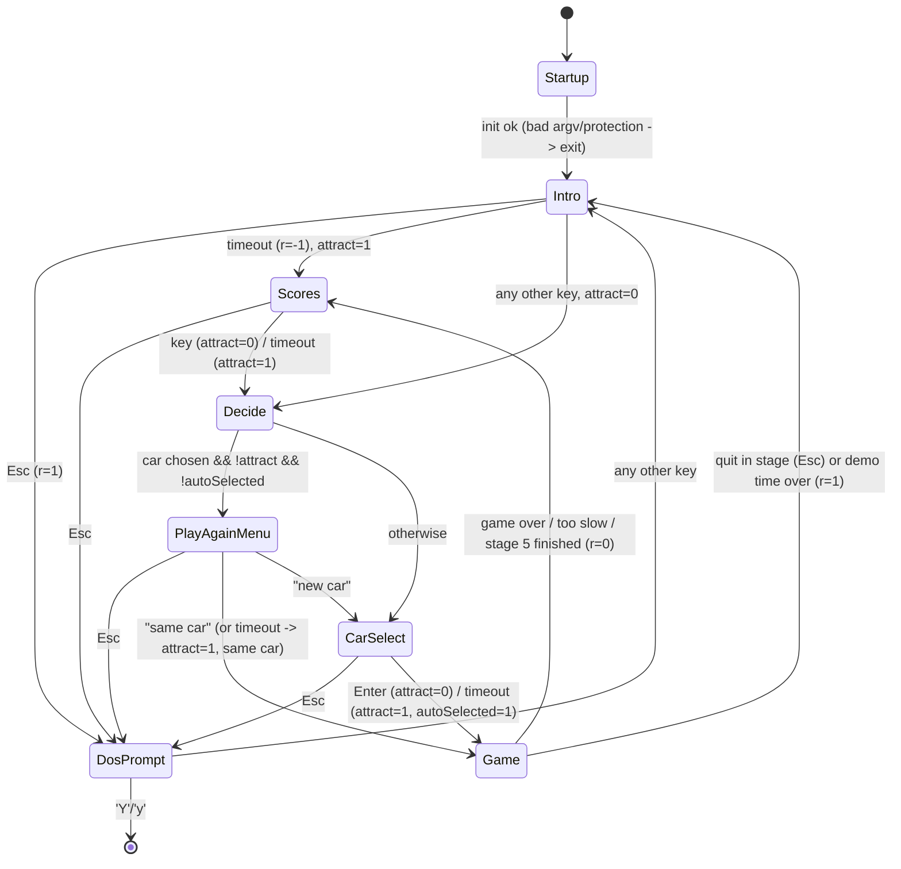

# game_flow — Test Drive (1987) TDEGA.EXE, image 0x0000–0x1F4D

Porting spec for the out-of-game flow: startup, intro, car select/showroom, the stage runner wrapper,
between-stage results (gas station), scoring, high scores, credits, endings and the "back to DOS" prompt.
Conventions follow `port/RE_GUIDE.md` (image offsets; `DS:xxxx` = image `0xC9A0+xxxx`).
File formats: `FORMATS.md`. Everything in the 0x0000–0x1F4D range was read in the Ghidra output and
cross-checked in the disassembly wherever control flow or arithmetic mattered. Anything not checked that way is
labelled `likely` or `guess`.

---

## 1. Overview

TDEGA is a Microsoft C program. The C runtime entry (0xA50C) calls `main` at **0x0010**.
`main` checks the launcher's password argument, sets up video, palette, input and a 100 Hz timer, loads
the sound bank and `CARS.TXT`, then loops forever through a small state machine built from `goto`s:

* **Intro** (0x037A): the Accolade logo (ACCOLADE.PES), then TESTDRV.PES: a car drives off while its
  window animates, then the "TEST DRIVE" logo drops in with damped bounces, followed by the key fob and
  the "CTRL-J / CTRL-K" line.
* **High-score table** (0x12DB): load/verify `SCORES`, run name entry if the last game qualifies, save,
  show "TEST DRIVE'S BEST", then the **credits** page if no key is pressed.
* **Play-again menu** (0x02BF): "Play again with the same car" or "Select a new car".
* **Car select** (0x098C): the top 88 lines show the car and its name plate and slide vertically when
  you change car. The bottom shows the spec sheet. Enter plays the `.SS` showroom animation, where the
  window moves and the car drives out.
* **Game** (0x1030): loops over stages 0..4. Each stage loads the XROAD archives and the car's `.PES`
  and `.BIN`, then runs **0x1DC0** (stage runner: the per-frame loop that calls into scene_render and
  simulation). After stages 0–3 it shows the gas station and scrolling results text with the score
  (0x1993/0x1B36). After stage 4 the dealership and glove-box note ending plays inside 0x1DC0.
  Five "lives" (crashes) are allowed, +2 per gas station. When they run out, GAME OVER is drawn.
* **Attract/demo mode** (`DS:0084 = 1`): starts on timeouts. It cycles cars at random, drives stage 4 for
  720 time units (about 58 s) with score forced to 0, and shows the high-score table with the controls hint.
* **Back to DOS** prompt (Y quits).

All screens are drawn with the platform's planar sprite blitters into either the EGA screen (descriptor
at code-segment image 0x5A7C) or one 320×200 offscreen page (`DS:7F1A`). They are revealed with an
8-step "wipe" (0x768B), and text uses an 8×8 bitmap font from the data segment (0x4BD0).

### Call graph (game_flow functions; `[x]` = other subsystem)

```
main 0x0010
 ├─ load_cars_txt 0x0243
 ├─ run_intro 0x037A ── intro_accolade 0x03F4
 │                    ├─ intro_testdrive_car 0x051B
 │                    └─ intro_testdrive_logo 0x0792
 ├─ high_scores 0x12DB ── scores_load 0x1369
 │                      ├─ scores_enter_name 0x1482 ── [platform] text_input 0x92A8
 │                      ├─ scores_save 0x162E
 │                      ├─ scores_show 0x16D7
 │                      └─ credits_show 0x186E
 ├─ play_again_menu 0x02BF
 ├─ car_select 0x098C ── show_car 0x0AB2
 │                    └─ showroom_drive_away 0x0D75 ── read_line_strip 0x1000
 └─ run_game 0x1030
      ├─ run_stage 0x1DC0 ── stage_init 0x1F4E, [scene_render] 0x1F93, [simulation] 0x4792,
      │                     per-frame [scene_render/simulation] 0x2013 0x2054 0x2478 0x3ACE 0x2EDC 0x28C5
      │                     0x33FB 0x2F7A 0x349D 0x3AF7 0x35C6 0x351A, [platform] 0x8BAF,
      │                     crash [scene_render] 0x392C, ending [scene_render] 0x38EB,
      │                     wait_any_input 0x1F7B
      ├─ stage_score 0x125D
      └─ stage_results 0x1993 ── results_text 0x1B36 ── results_add_line 0x1CFA
                                                     └─ results_scroll 0x1D20
```

### Screen-flow state diagram (verified against `main` disassembly 0x0010–0x0242)



Inside **Game** (0x1030):

```
for stage = (attract ? 4 : 0) .. 4:
    load XROADA/B/C, <car>.PES, <car>.BIN ; 4 s delay
    run_stage 0x1DC0 ->
        -1 : Esc (event 1) or demo timeout      -> total=0, return 1 (to Intro)
         0 : lives exhausted -> GAME OVER overlay, wait input -> wipe to black, return 0 (Scores)
         1 : stage end reached and car stopped (stage 4: dealership + glove-box note first)
    score = stage_score() (0 in attract); total += score
    if stage == 4: return 0 (Scores)
    gas station + results text (score) ; lives += 2
    if average speed < 50: return 0 (Scores)  ("dealership called / too slowly")
```

---

## 2. Function table

### 2a. Functions in this subsystem

| image addr | proposed name | signature | purpose | confidence |
|---|---|---|---|---|
| 0x0010 | `main` | `int main(int argc, char **argv)` | Startup, top-level state machine, shutdown | verified |
| 0x0243 | `load_cars_txt` | `void (void)` (called once with a dummy arg 1) | Reads up to 10 lines of CARS.TXT into DS:7F64, pointers at DS:78F2 | verified |
| 0x02BF | `play_again_menu` | `int (void)` → 0 same car, 1 new car, -1 Esc | Two-item highlighted menu | verified |
| 0x037A | `run_intro` | `int (void)` → key code, -1 timeout, 1 Esc | Intro music, Accolade logo, then Test Drive intro | verified |
| 0x03F4 | `intro_accolade` | `int (void)` | ACCOLADE.PES: wipe in acc/pres/copy, animate 'bull' bar | verified |
| 0x051B | `intro_testdrive_car` | `int (void)` | TESTDRV.PES: window anim, then the car accelerates off to the left | verified |
| 0x0792 | `intro_testdrive_logo` | `int (void)` | 'tdrv' logo drops with damped bounce; then fob, ™ mark and controls hint | verified |
| 0x098C | `car_select` | `int (void)` → 0 Enter, 1 Esc, -1 timeout | Car selection (Up/Down), attract auto-cycling | verified |
| 0x0AB2 | `show_car` | `void (int carIdx, int dir)` dir ∈ {0,1,-1} | Load `<car>SB.PES`, slide the top 88 lines, draw spec sheet 'stat' | verified (scroll primitive: guess) |
| 0x0D75 | `showroom_drive_away` | `void (int carIdx)` | Parse `<car>.SS`, play window + wheel animation, car drives out | verified |
| 0x1000 | `read_line_strip` | `void (char *buf, int n, FILE *f)` | `fgets` then overwrite last char (the '\n') with 0 | verified |
| 0x1030 | `run_game` | `int (void)` → 0 to scores, 1 to intro | Stage loop, lives, total score | verified |
| 0x125D | `stage_score` | `long (void)` | Score for the finished stage from time vs par | verified |
| 0x12DB | `high_scores` | `int (long newScore)` → key, -1, 1 | Load, insert/save if qualifies, show table, credits | verified |
| 0x1369 | `scores_load` | `void (char names[8][20], long scores[8], char cars[8][20])` | Parse SCORES with CRC-8 check; pad missing | verified |
| 0x1482 | `scores_enter_name` | `void (long score, int carIdx, names, scores, cars)` | "You have qualified…" screen, name entry, insert | verified |
| 0x162E | `scores_save` | `void (names, scores, cars)` | Write SCORES with CRC lines | verified |
| 0x16D7 | `scores_show` | `int (names, scores, cars)` → key/-1/1 | "TEST DRIVE'S BEST" table (20 s) | verified |
| 0x186E | `credits_show` | `int (void)` → key/-1/1 | Credits page (10 s) | verified |
| 0x1993 | `stage_results` | `void (long stageScore)` | Gas-station screen and results text; wait for key | verified (wipe pacing: see §6) |
| 0x1B36 | `results_text` | `void (long stageScore)` | Compose results lines into the offscreen page and scroll them | verified |
| 0x1CFA | `results_add_line` | `void (const char *s)` | Draw line at (0, y) on page, y += 8, count++ (skips "") | verified |
| 0x1D20 | `results_scroll` | `void (void)` | Scroll page up into the y 176..199 window, 8 px per line | verified |
| 0x1DC0 | `run_stage` | `int (void)` (asm, no frame) → -1/0/1 | One stage: setup, per-frame loop, crash/lives, end, teardown | verified |
| 0x1F4E | `stage_init` | `void (void)` | Road position = stage start + 45, zero timers | verified |
| 0x1F7B | `wait_any_input` | `void (void)` | Loop until a key or fire button is pressed (returns at once in attract) | likely (0x5C24 return format) |

### 2b. External functions used here (owned by other specs; names are provisional)

| image addr | proposed name | signature (as used) | purpose | owner / confidence |
|---|---|---|---|---|
| 0x1F93 | `car_state_reset` | `void(void)` | Reset per-life car/sim state (0927, 0929, …) | scene_render — likely |
| 0x2013,0x2054,0x2478,0x3ACE,0x2EDC,0x28C5,0x33FB,0x2F7A,0x349D,0x3AF7,0x35C6,0x351A | per-frame stage calls | `void(void)` | road update/render, mirror, objects, cockpit, gauges | scene_render/simulation |
| 0x38EB | `ending_dealership` | `void(void)` | Draws 'deal', wait input, draws glove-box 'note', wait input | scene_render — verified (decompile) |
| 0x392C | `crash_sequence` | `void(void)` | Crash animation; waits for input unless last life | scene_render — likely |
| 0x4792 | `stage_setup` | `void(void)` | Allocates cockpit pages, resolves sprite lists, starts song DS:0B05, hooks int 0/int 8 | simulation — likely |
| 0x4941 | `fill_rect` | `(x, y, w, h, color)` | Solid rectangle | platform — likely |
| 0x4B98 | `clear_screen` | `(color)` | Fill all 4 planes of A000 (8000 bytes, write mode 2) | platform — verified |
| 0x4BD0 | `draw_text` | `(char *s, int x, int y)` | Set pen, fall into 0x4BE7 text renderer | platform — verified |
| 0x4D84 | `set_palette` | `(int dsOff)` | int 10h AX=1002h, ES:DX = DS:dsOff | platform — verified |
| 0x4D96 | `video_init` | `(void)` | Set EGA mode 0Dh | platform — likely |
| 0x50A1 | `set_clip` | `(desc far*, x0b, x1b, y0, y1)` | Clip rect (x in bytes 0..40, y in lines) | platform — verified |
| 0x50FE | `restore_text_mode` | `(void)` | Back to text mode | platform — likely |
| 0x5128 | `set_target` | `(desc far*)` | Select draw target (copies 12 words to CS:5A64) | platform — verified |
| 0x5150 | `alloc_page` | `(wBytes, h, planes)` → far handle | Allocate offscreen bitmap | platform — likely |
| 0x5C24 | `read_joy_key` | `() → ax` | Direction/fire bits (0x10 = fire), AH=0xFF for other keys | platform — likely |
| 0x5D84 | `draw_sprite_at_hot` | `(spr far*, x, y)` | Draw at x−hot_x, y−hot_y | platform — likely |
| 0x5DB6 | `draw_sprite_at` | `(spr far*, x, y)` | Draw sprite with top-left at (x,y), clipped | platform — likely |
| 0x5DE2 | `draw_sprite_5DE2` | `(spr far*)` | Draw at sprite's own x,y (variant) | platform — guess |
| 0x6762 | `find_res` | `(archive far*, char name[4]) → far*` | Find by 4-char name (NUL→space); fatal if missing | platform — verified |
| 0x67DD | `wait_key` | `() → int` | Loop input handler until non-zero | platform — verified |
| 0x6939 | `kbd_flush` | `(void)` | Drain BIOS keyboard buffer (int 16h) | platform — verified |
| 0x694A | `timer_stop` | `(void)` | Restore int 8 vector/PIT, speaker off | platform — likely |
| 0x699E | `timer_start` | `(void)` | PIT divisor 0x2E97 (100.04 Hz), install ISR 0x6A1F | platform — verified |
| 0x6C3B | `delay` | `(uint ticks)` | Busy-wait n timer ticks | platform — verified |
| 0x6C85 | `text_color` | `(fg, bg)` | DS:690E=fg, DS:6910=bg | platform — verified |
| 0x6CBE | `draw_sprite_at_hot2` | `(spr far*, x, y)` | Draw at x−hot_x, y−hot_y (unclipped variant) | platform — likely |
| 0x6D1C | `draw_sprite` | `(spr far*)` | Draw at sprite's own x,y | platform — likely |
| 0x74F4 | `fill_clip` | `(color)` | Fill the current target's clip rect | platform — verified |
| 0x768B | `wipe_step` | `(page far*, step 0..7)` | One step of the 8-step page→screen reveal | platform — guess (pattern) |
| 0x7881 | `frame_wait` | `(void)` | Wait for deadline set by 0x7894 | platform — verified |
| 0x7894 | `frame_start` | `(uint ticks)` | Deadline = now + ticks (DS:650C/650E) | platform — verified |
| 0x78A5 | `load_sound_bank` | `(name, size)` | Load TDSND.SND | platform — likely |
| 0x79FF | `free_page` | `(far*)` | Free bitmap | platform — likely |
| 0x7A5F / 0x7C63 | `draw_or` / `draw_and_mask` | `(spr far*)` | OR sprite / AND mask at own x,y | platform — likely |
| 0x89F0 | `song_stop` | `(void)` | Clear play bits in DS:643E | platform — likely |
| 0x8A08 | `sound_stop_all` | `(void)` | DS:643E &= 4 | platform — likely |
| 0x8A0E / 0x8A3E | `song_queue` / `song_play` | `(far* song)` | See FORMATS.md (sound) | platform — verified (FORMATS) |
| 0x8A5B | `load_archive` | `(char *file, uint sizeHint) → far*` | Load/decompress PES, cached by name (0xA280) | platform — likely |
| 0x8AFD | `input_select` | `(int mode)` | DS:6422 = mode (index into handler table 0x67F2) | platform — verified |
| 0x8BAF | per-frame platform call | `(void)` | Last call of each stage frame (flip/sync?) | platform — guess |
| 0x8CC0 | `dos_mem_init` | `(void)` | int 21h 48h/4Ah memory setup | platform — likely |
| 0x8CEC / 0x8D3C | `herc_init` / `herc_shutdown` | `(void)` | Hercules setup/restore (unreachable here, see §7) | platform — likely |
| 0x8D8C | `crc8` | `(char *p, int len, uint8 seed) → uint8` | Reflected poly 0xB8 | verified |
| 0x8DC7 | `copyprot_check` | `() → 0 ok` | Copy protection (drop in port; treat as 0) | platform — verified |
| 0x91CF | `scroll_rect` | `(x0, y0, wB, h, dy, src far*, srcRow)` | Scroll region 1 line, pull row from source | platform — guess |
| 0x92A8 | `text_input` | `(char *buf, int len, int x, int y, uint timeout)` | Line editor with cursor (0x9A69) | platform — verified |
| 0x94AB | `fatal` | `(fmt, …)` | printf + exit | verified (RE_GUIDE) |
| 0x94C7 | `find_res_list` | `(archive, char *names4, far* out[])` | Resolve concatenated 4-char names | platform — verified |
| 0x9507 | `draw_text_centered` | `(char *s, int y)` | x = 160 − 4·strlen | platform — verified |
| 0x9530 | `draw_box` | `(x0, y0, x1, y1, color)` | 1-px rectangle outline via fill_rect | platform — verified |
| 0x95B0 | `wait_input_deadline` | `() → int` | Poll input until deadline: 0→-1, Esc(0x1B)→1, else key | platform — verified |
| 0x95D9 | `toupper` | `(char)` | a–z → A–Z | verified |
| 0xA90E | `rand` | `() → 0..32767` | MS C LCG (DS:707A) | platform — likely |
| 0xAA00/0xA6B1/0xA659/0xA6D7/0xA5B6/0xA70E/0xAA51/0xAABD/0xAAD8/0xAA88 | MS C `sprintf/fopen/fgets/fprintf/fclose/fscanf/sscanf/strlen/strncpy/strcmp` | | C runtime | likely |
| 0xA776/0xA93A/0xA4F8/0x493D | `open/read/close`, `car_bin_buffer` (→DS:268F) | | C runtime / car loader | likely |
| 0xC91D/0xC87A/0xC954/0xC95F | `_almul`, `_aldiv`, `long_sar(cl)`, `ldiv_assign(long*, long)` | | long math helpers | verified (C954/C95F), likely (others) |

---

## 3. Globals table

`W` = written by, `R` = read by (from `globals_xref.txt` plus the decompile).

| DS offset | proposed name | type/size | meaning | written by | read by |
|---|---|---|---|---|---|
| 0084 | `g_attract` | int16 | 1 = attract/demo mode | 0010, 02BF, 098C | 0010, 098C, 1030, 16D7, 1DC0, 1F7B |
| 0086 | `g_carAutoSelected` | int16 | Car was picked by timeout, so car select is forced next time | 098C | 0010 |
| 0088 | `g_numCars` | int16 | Lines read from CARS.TXT (≤10) | 0243 | 098C |
| 008A | `g_hercules` | int16 | "herc" argv flag | 0010 | 0010 |
| 00CC | `PALETTE_EGA` | uint8[17] | int 10h/1002h table: `00 01 02 03 04 05 07 16 00 10 06 12 13 14 11 17 00` (16 palette registers + overscan) | const | 4D84 |
| 00DE | `LAUNCH_PASSWORD` | char[] | "94857102387604294775" (argv[1] from TD.EXE) | const | 0010 |
| 0118 | `g_introArchive` | far ptr | ACCOLADE.PES, then TESTDRV.PES | 037A | 03F4, 051B, 0792 |
| 029E | `STAGE_SCORE_FACTOR` | int16[5] | {4,5,6,7,8} | const | 125D |
| 02A8 | `STAGE_PAR_TIME` | int16[5] | {98,134,131,123,153} (units of stage time ÷12, "seconds") | const | 1030 |
| 02B2 | `STAGE_CONST_B` | int16[5] | {250,233,291,333,375}, copied to DS:7F40 and never read (dead) | const | 1030 |
| 077A–07BA | `MSG_TABLES` | near char*[33] | Results messages, see §4 `results_text` | const | 1B36 |
| 07BC | `GAS_SIGN_NAMES` | near char*[4] | "don ","john","kevn","tony" (index = stage 0..3) | const | 1993 |
| 0B05 | `SONG_INGAME` | bytecode | In-stage song passed to 8A0E | const | 1DC0, 4792 |
| 0906 | `g_roadPos` | int16 | Current road stream index (shared with simulation) | 1F4E, sim | 1DC0 |
| 0927 | `g_carSpeedFixed` | int16 (hi byte = mph) | Must be 0 for a stage end to register | 1F93, sim | 1DC0, 35C6 |
| 0929 | `g_stageEvent` | uint8 | 0 driving; 1 quit (set 0x3BA5); 2 stage end reached (set 0x4276); ≥3 crash (0x3F09, 0x3FE2, 0x419D, 0x42D1, 0x4377, 0x44EA) | 1F93, sim | 1DC0, 2054, 2478, 349D |
| 0934/0936 | `g_savedInt0` | far ptr | Old int 0 vector (installed by 4792) | 4792 | 1DC0 |
| 093C | `g_093C` | uint8 | Cleared on crash (simulation flag) | 1DC0, 1F93 | sim — guess |
| 102F/1033 | `spr_govr`/`spr_gvrm` | far ptr | XROADA "GAME OVER" sprite and its mask | 4792 | 1DC0 |
| 1037/103B/103F | `spr_deal`/`spr_note`/`spr_tick` | far ptr | Dealership, glove-box note, ticket | 4792 | 38EB, 349D |
| 1383/13DB/13BB | `spr_dash`/`spr_roof`/`spr_mirr` | far ptr | Cockpit sprites from `<car>.PES` | 4792 | 1DC0, 349D, 38EB |
| 642A | `g_timerTicks` | uint16 | +1 per timer IRQ (100.04 Hz) | ISR 0x6A1F | 9A01, 9A05 |
| 650C/650E | `g_frameStart`/`g_frameLen` | uint16 | Deadline for `frame_start` | 7894 | 7864, 7881 |
| 690E/6910 | `g_textFg`/`g_textBg` | uint16 (low byte used) | Text colours (initial 3/0) | 6C85 | 4BD0 |
| 6912 | `g_textLeft` | int16 | x after CR/LF | — | 4BE7 |
| 6914/6916 | `g_penX`/`g_penY` | int16 | Text pen | 4BD0 | 4BE7 |
| 691A | `g_glyphH` | int16 = 8 | Glyph rows | const | 4BE7 |
| 691C | `g_glyphTable` | far ptr = 0C9A:6E2C | 256 near ptrs to glyphs | const | 4BE7 |
| 6920/6922 | `g_advanceX`/`g_lineH` | int16 = 8/8 | Cell size | const | 4BE7 |
| 6924 | `g_textEnable` | int16 = 1 | Text drawn only when 1 | const | 4BE7 |
| 78E2 | `g_showroomCarSpr` | far ptr | 'car ' from `<car>SB.PES` | 0AB2 | 0D75 |
| 78E6 | `g_lives` | int16 | Starts at 5, −1 per crash, +2 per gas station | 1030, 1993, 1DC0 | 1DC0, 392C |
| 78E8/7906/7B2A/8090 | `g_songIntro`/`g_songCarSel`/`g_songHiScore`/`g_songGas` | far ptr | sng2 / sng4 / sng3 / sng1 in TDSND.SND | 0010 | 037A, 098C, 1482, 1993 |
| 78EC | `g_avgSpeed` | int16 | Distance in road units at stage end, then converted to average speed | 1DC0, 1030 | 1B36 |
| 78EE | `g_carSBArchive` | far ptr | Loaded `<car>SB.PES` | 0AB2 | 0D75 |
| 78F2 | `g_carNames` | near char*[10] | Into DS:7F64 buffer | 0243 | 0AB2, 0D75, 1030, 12DB |
| 790A | `g_selectedCar` | int16, −1 = none | Index into car names | 0010, 098C | 0010, 1030, 12DB, 35C6 |
| 790C | `g_resultLineCount` | int16 | Lines composed | 1B36, 1CFA | 1D20 |
| 7B12 | `g_scrollDelay` | int16 | Ticks per pixel of results scroll (15, or 1 once a key is pressed) | 1993, 1D20 | 1D20 |
| 7B16 | `g_stage` | int16 0..4 | Current stage | 1030 | many |
| 7B1C/7B20/7B26 | `g_xroadA/B/C` | far ptr | Road-object archives | 1030 | 4792 |
| 7B32 | `g_carArchive` | far ptr | `<car>.PES` cockpit | 1030 | 4792 |
| 7F1A | `g_offscreenPage` | far ptr (handle) | 320×200 16-colour page (0x28 bytes × 200) | 0010, 1030 | most screens |
| 7F40 | `g_stageConstB` | int16 | Copy of DS:02B2[stage]; no reader found | 1030 | — |
| 7F44 | `g_tooSlow` | int16 | Average speed < 50 → run ends after results | 1030, 1B36 | 1030, 1B36 |
| 7F46 | `g_sbArchiveName` | char[30] | "%ssb.pes" | 0AB2 | 0AB2, 1993 |
| 7F64 | `g_carNameBuf` | char[~300] | CARS.TXT text | 0243 | via 78F2 |
| 8094 | `g_parTime` | int16 | STAGE_PAR_TIME[stage] | 1030 | 125D |
| 8098 | `g_totalScore` | int32 | Accumulated score | 0010, 1030 | 0010, 16D7 |
| 80A4 | `g_stageTime` | int16 | Stage time, +1 every 8 sim ticks (0x3B8A), +240 per crash; ÷12 after stage | 1DC0, 1F4E, sim, 1030 | 1030, 125D, 1B36, 35C6 |
| 80A6 | `g_resultTextY` | int16 | Next line y on page | 1B36, 1CFA | 1CFA |

---

## 4. Pseudocode

Common helper semantics used below (platform, see §2b):
`frame_start(n)` sets a deadline n ticks (1/100 s) from now; `wait_input()` (0x95B0) polls input until
a key arrives (returns it) or the deadline passes (returns −1), and maps Esc to 1. So
`frame_start(n); draw…; k = wait_input();` is **one animation frame of n×10 ms** that a key can interrupt.
Keys are ASCII if non-zero, otherwise `scancode<<8` (Up 0x4800, Down 0x5000, Left 0x4B00, Right 0x4D00,
Ins 0x5200, Del 0x5300). Joystick fire is reported as 0x0D (Enter). `SCREEN` = descriptor at image 0x5A7C,
`PAGE` = `g_offscreenPage`. `set_clip(d, x0, x1, y0, y1)`: x in bytes (0x28 = 320 px), y in lines.

### main — 0x0010 (verified)
```c
int main(int argc, char **argv) {
    if (copyprot_check()) return 0;                          /* port: skip */
    if (strcmp(argv[1], "herc") == 0) { herc_init(); g_hercules = 1; }
    if (strcmp(argv[1], "94857102387604294775") != 0) return 0; /* must be run from TD.EXE */
    dos_mem_init();
    video_init();                        /* mode 0Dh */
    set_palette(0x00CC);                 /* AX=1002h, table DS:00CC */
    input_select(4);
    timer_start();                       /* 100 Hz */
    far snd = load_sound_bank("tdsnd.snd", 0x26D1);
    g_songGas = find_res(snd,"sng1"); g_songIntro = find_res(snd,"sng2");
    g_songCarSel = find_res(snd,"sng4"); g_songHiScore = find_res(snd,"sng3");
    g_offscreenPage = alloc_page(0x28, 200, 0x0F);
    g_totalScore = 0; g_selectedCar = -1; g_attract = 0;
    load_cars_txt();
    kbd_flush();
    for (;;) {
INTRO:  g_attract = 0;
        r = run_intro();
        if (r == 1) goto DOS;
        if (r != -1) goto DECIDE;
        g_attract = 1;
SCORES: r = high_scores(g_totalScore);
        g_totalScore = 0;
        if (r == 1) goto DOS;
        g_attract = (r == -1);
DECIDE: need = (g_selectedCar == -1) | g_attract | g_carAutoSelected;
        if (need == 0) {
            need = play_again_menu();
            if (need == -1) goto DOS;
        }
        if (need != 0) {
            load_cars_txt();
            r = car_select();
            if (r == 1) goto DOS;
            g_attract = (r == -1);
        }
        g_totalScore = 0;
        r = run_game();
        if (r == 1 || r == -1) goto INTRO;
        if (r == 0) goto SCORES;
DOS:    if (copyprot_check()) break;
        clear_screen(0);
        set_target(SCREEN);
        text_color(0x0F, 1);
        draw_text_centered(" BACK TO DOS (Y or other key) ? ", 100);
        if (toupper(wait_key()) == 'Y') break;
    }
    if (g_hercules == 0) restore_text_mode(); else herc_shutdown();
    timer_stop();
    return 0;
}
```
Note: `run_game` sets `g_totalScore` itself, and the SCORES entry passes the value from the finished game.

### load_cars_txt — 0x0243 (verified)
```c
void load_cars_txt(void) {
    FILE *f = fopen("CARS.TXT", "r");          /* no NULL check in original */
    int off = 0; g_numCars = 0;
    do {
        if (fgets(g_carNameBuf + off, 30, f) == NULL) break;
        g_carNames[g_numCars++] = g_carNameBuf + off;
        off += strlen(g_carNameBuf + off);
        g_carNameBuf[off - 1] = 0;             /* kill '\n' */
    } while (g_numCars < 10);
    fclose(f);
}
```
CARS.TXT = `counta lotus p911t rossa vette` (CRLF lines, ^Z at the end; text mode handles both).

### play_again_menu — 0x02BF (verified)
```c
int play_again_menu(void) {
    clear_screen(0);
    for (;;) {
        int sel = 0;
        for (;;) {
            int a = sel ? 0x0F : 0x00, b = sel ? 0x00 : 0x0F;
            text_color(a, b); draw_text_centered(" Play again with the same car ", 0x8C);
            text_color(b, a); draw_text_centered("       Select a new car       ", 0xAC);
            frame_start(12000);                /* 120 s */
            int k = wait_input();
            if (k == 0x0D) { g_attract = 0; return sel; }
            if (k == -1)   { g_attract = 1; return sel; }
            if (k == 0x4800) break;            /* Up -> sel = 0 */
            if (k == 0x5000) sel = 1;          /* Down */
            else if (k == 1) return -1;        /* Esc */
        }
    }
}
```

### run_intro — 0x037A (verified)
```c
int run_intro(void) {
    clear_screen(0);
    song_play(g_songIntro);
    g_introArchive = load_archive("ACCOLADE.PES", 2000);
    int r = intro_accolade();
    if (r == -1) { g_introArchive = load_archive("TESTDRV.PES", 2000); r = intro_testdrive_car(); }
    if (r == -1) r = intro_testdrive_logo();
    song_stop();
    if (copyprot_check()) r = 1;
    return r;
}
```

### intro_accolade — 0x03F4 (verified)
```c
int intro_accolade(void) {
    set_target(PAGE); fill_clip(0);
    draw_sprite(find_res(A,"acc ")); draw_sprite(find_res(A,"pres")); draw_sprite(find_res(A,"copy"));
    set_target(SCREEN);
    for (int i = 0; i < 8; i++) { frame_start(1); wipe_step(PAGE, i); int k = wait_input(); if (k != -1) return k; }
    spr *bull = find_res(A, "bull");           /* 32x3 px bar, x=256 y=34 */
    int xEnd = bull->x /*+8*/, y = bull->y /*+0x0A*/;
    for (int x = 0; x < xEnd; x += 2) {        /* bar is not erased, so it leaves a trail (underline sweep) */
        frame_start(1); draw_sprite_at(bull, x, y);
        int k = wait_input(); if (k != -1) return k;
    }
    frame_start(100); return wait_input();
}
```

### intro_testdrive_car — 0x051B (verified)
Name lists: `frm[5]` = "frm1…frm5", `rrm[5]` = "rrm1…rrm5", `wnd[33]` = DS:0148
"wnd1 wnd2 wnd3 wnd4 wnd4 wnd5 … wndR wndR wndR wndR wndR wndR" (wnd1..wndR with wnd4 doubled and wndR ×6).
```c
int intro_testdrive_car(void) {
    find_res_list(A, "frm1frm2frm3frm4frm5", frm); find_res_list(A, "rrm1…", rrm); find_res_list(A, DS_0148, wnd);
    set_target(PAGE); fill_clip(0); draw_sprite(find_res(A, "car "));
    set_target(SCREEN);
    for (int i = 0; i < 8; i++) { frame_start(10); wipe_step(PAGE, i); int k = wait_input(); if (k != -1) return k; }
    int done = 0, moving = 0, dist = 0, vel = 0, wf = 0, k;
    do {
        if (done) return -1;
        set_target(PAGE);
        frame_start(4);
        if (moving == 1) {
            draw_sprite(rrm[dist % 5]);
            draw_sprite(frm[((dist + 4) / 5) % 5]);
            dist += vel >> 4;  vel += 10;      /* int16, arithmetic shift */
            done = (dist > 319);
            frame_start(4);
        }
        if (moving == 0 || wf < 33) {
            draw_sprite(wnd[wf]); wf++;
            if (wf < 26) frame_start(20); else moving = 1;
        }
        set_target(SCREEN);
        set_clip(SCREEN, 0, 0x28, 100, 200);
        int w = dist > 32 ? 32 : dist;
        if (w) fill_rect(320 - dist, 100, w, 0x50, 0);
        draw_sprite_at(PAGE, 0 - dist, 0);     /* whole page shifted left */
        k = wait_input();
    } while (k == -1);
    return k;
}
```

### intro_testdrive_logo — 0x0792 (verified against disassembly)
```c
int intro_testdrive_logo(void) {
    spr *logo = find_res(A, "tdrv"); int lx = logo->x, ly = logo->y;    /* 16,133 */
    set_target(SCREEN);
    set_clip(SCREEN, 0, 0x50, 0, 200);          /* x1 = 0x50 as in original */
    int phase = 0, settle = 0, finished = 0, damp = 7;
    int16 accel = 0x30C, y = -0xC3;  int32 vel = 0;
    for (;;) {
        if (phase == 0) {
            y += (int16)(vel >> 12);  vel += accel;
            if (y > 0) { accel = (int16)(accel * -7); phase = 1; vel = -vel; }
        } else if (phase == 1) {
            int16 prev = y;
            y += (int16)(vel >> 12);  vel += accel;
            if ((y >= 0 && prev < 0) || (y < 0 && prev >= 0)) { vel = vel / damp; damp++; accel = -accel; }
            if (y == 0 && vel > -0xDAC && vel < 0xDAC) phase = 2;
        } else {
            y = 0; settle++; finished = (settle > 5);
        }
        frame_start(10);
        draw_sprite_at(logo, lx, ly + y);
        int k = wait_input(); if (k != -1) return k;
        if (finished) {
            draw_sprite(find_res(A, "fob ")); draw_sprite(find_res(A, "tmar"));
            text_color(0x0F, 0);
            draw_text_centered("CTRL - (J)OYSTICK OR CTRL - (K)EYBOARD", 0xB4);
            frame_start(1000); return wait_input();   /* 10 s */
        }
    }
}
```
`vel >> 12` is a 32-bit arithmetic shift (helper 0xC954). `vel / damp` is signed 32-bit division (0xC95F → 0xC87A).

### car_select — 0x098C (verified)
```c
int car_select(void) {
    int idx = 0, k, n;
    clear_screen(0); song_play(g_songCarSel); show_car(0, 0);
    for (;;) {
        frame_start(12000);
        kbd_flush();
        if (!g_attract) k = wait_input();
        else {
            n = (rand() & 3) + 5;
            for (;;) {
                frame_start(400);
                if (n == 0) break;
                k = wait_input();
                if (k != -1) { g_attract = 0; break; }
                if (++idx >= g_numCars) idx = 0;
                show_car(idx, -1);
                n--;
            }
        }
        if (k == -1)   { showroom_drive_away(idx); g_selectedCar = idx; g_carAutoSelected = 1; song_stop(); return -1; }
        if (k == 1)    { song_stop(); return 1; }
        if (k == 0x4800) { if (++idx >= g_numCars) idx = 0; show_car(idx, -1); continue; }
        if (k == 0x5000) { if (--idx < 0) idx = g_numCars - 1; show_car(idx, 1); continue; }
        if (k == 0x0D) { showroom_drive_away(idx); g_selectedCar = idx; g_carAutoSelected = 0; song_stop(); return 0; }
    }
}
```

### show_car — 0x0AB2 (flow verified; `scroll_rect` semantics guess)
```c
void show_car(int idx, int dir) {
    spr *old = *g_offscreenPage;                     /* page contents = previous car image */
    set_clip(SCREEN, 0, 0x28, 0, 0x58);              /* top 88 lines */
    if (dir == 1)       for (int i = -0x57; i < 1; i++) { frame_start(1); scroll_rect(0,0x57,0x28,0x57,-0x28, NULL,0); frame_wait(); set_clip(SCREEN,0,0x28,0,0x58); }
    else if (dir == -1) for (int i =  0x57; i >= 0; i--) { frame_start(1); scroll_rect(0,0,0x28,0x57, 0x28, NULL,0); frame_wait(); set_clip(SCREEN,0,0x28,0,0x58); }
    sprintf(g_sbArchiveName, "%ssb.pes", g_carNames[idx]);
    g_carSBArchive = load_archive(g_sbArchiveName, 0x109A);
    g_showroomCarSpr = find_res(SB, "car ");
    spr *stat = find_res(SB, "stat"), *name = find_res(SB, "name");
    set_target(PAGE); fill_clip(0); draw_sprite(g_showroomCarSpr); draw_sprite(name);
    set_clip(SCREEN, 0, 0x28, 0, 0x58); set_target(SCREEN);
    if (dir == 0) draw_sprite(old);                  /* page at (0,0), clipped to 88 lines */
    else if (dir == 1)  for (int i = -0x57; i < 1; i++) { frame_start(1); scroll_rect(0,0x57,0x28,0x57,-0x28, old, -i);     frame_wait(); set_clip(SCREEN,0,0x28,0,0x58); }
    else                for (int i =  0x57; i >= 0; i--) { frame_start(1); scroll_rect(0,0,0x28,0x57, 0x28, old, 0x57-i); frame_wait(); set_clip(SCREEN,0,0x28,0,0x58); }
    set_clip(SCREEN, 0, 0x28, 0, 200); set_target(SCREEN);
    draw_sprite(stat);                               /* spec sheet at y=88, 112 lines */
}
```
Port interpretation: the old image scrolls out of the 88-line top band one line per tick (88 ticks), then the
new one scrolls in from the same side. dir −1 (Up = next car) and dir +1 (Down) move in opposite directions.
Which direction each one moves is not confirmed (0x91CF is not analysed).

### showroom_drive_away — 0x0D75 (verified)
`.SS` format: `"%d %d\n"` = `wndCount startFrame` (all shipped files: 15 5), then three lines of
concatenated 4-char names: front wheel frames (3), rear wheel frames (3), window frames (wndCount).
```c
void showroom_drive_away(int idx) {
    char fn[30], frmN[30], rrmN[30], wndN[130]; spr *frm[?], *rrm[6], *wnd[41]; int wndCount, startFrame;
    sprintf(fn, "%s.ss", g_carNames[idx]);
    FILE *f = fopen(fn, "r"); if (!f) fatal("Animation file open error");
    fscanf(f, "%d %d\n", &wndCount, &startFrame);
    read_line_strip(frmN, 30, f); read_line_strip(rrmN, 30, f); read_line_strip(wndN, 130, f);
    fclose(f);
    find_res_list(g_carSBArchive, frmN, frm); find_res_list(g_carSBArchive, rrmN, rrm); find_res_list(g_carSBArchive, wndN, wnd);
    set_target(PAGE); fill_clip(0); draw_sprite(g_showroomCarSpr);
    spr *pg = *g_offscreenPage; int done = 0, moving = 0, dist = 0, vel = 0, wf = 0;
    while (!done) {
        set_target(PAGE);
        if (moving == 1) {
            draw_sprite(rrm[dist % 3]);
            draw_sprite(frm[((dist + 4) / 5) % 3]);
            dist += vel >> 4; vel += 10;
            done = (dist > 319);
            frame_start(6);
        }
        if (moving == 0 || wf < wndCount) {
            draw_sprite_5DE2(wnd[wf]);
            frame_start(30);                  /* overrides the 6 above while the window still animates */
            if (++wf >= startFrame) moving = 1;
        }
        set_clip(SCREEN, 0, 0x28, 0, 0x58); set_target(SCREEN);
        draw_sprite_at(pg, 0 - dist, 0);
        frame_wait();                          /* not interruptible */
    }
    set_clip(SCREEN, 0, 0x28, 0, 200);
    delay(100);
}
```
Quirk to keep: wheel frame indices use `% 3` (the TESTDRV intro uses `% 5`). The window frame is drawn
before any wheel update in frame 0 only. The car keeps moving at 30 ticks/frame until `wf` reaches `wndCount`.

### read_line_strip — 0x1000 (verified)
`fgets(buf, n, f); buf[strlen(buf) - 1] = 0;` (the last char is removed even if it is not '\n').

### run_game — 0x1030 (verified against disassembly; the Ghidra return paths are misleading)
```c
int run_game(void) {
    int r; long score;
    g_lives = 5; g_totalScore = 0; g_tooSlow = 0;
    g_stage = g_attract ? 4 : 0;
    for (;;) {
        g_parTime = STAGE_PAR_TIME[g_stage]; g_stageConstB = STAGE_CONST_B[g_stage];
        g_xroadA = load_archive("xroada.pes", 0x1E84);
        g_xroadB = load_archive("xroadb.pes", 0x17AE);
        g_xroadC = load_archive("xroadc.pes", 0x0FA0);
        sprintf(tmp, "%s.pes", g_carNames[g_selectedCar]); g_carArchive = load_archive(tmp, 0x7D0);
        sprintf(tmp, "%s.bin", g_carNames[g_selectedCar]);
        int fd = open(tmp, 0x8000 /*O_BINARY*/); read(fd, car_bin_buffer() /*DS:268F*/, 0x4D6); close(fd);
        delay(400);                                   /* 4 s */
        free_page(g_offscreenPage);
        r = run_stage();
        g_offscreenPage = alloc_page(0x28, 200, 0x0F);
        if (g_stageTime == 0) g_stageTime = 1;
        g_avgSpeed = (int16)(((int32)g_avgSpeed * 0x5A) / (int32)g_stageTime);   /* distance*90/time */
        g_stageTime = g_stageTime / 12;                                          /* signed idiv */
        timer_start();                                /* run_stage stopped the 100 Hz timer */
        if (r != 1) break;
        score = stage_score();
        if (g_attract) score = 0;
        g_totalScore += score;
        if (g_stage >= 4) return 0;
        stage_results(score);
        if (g_tooSlow) return 0;
        g_stage++;
    }
    if (r != 0) { g_totalScore = 0; return 1; }       /* r == -1: Esc or demo timeout */
    set_target(PAGE); fill_clip(0); set_target(SCREEN);
    for (int i = 0; i < 8; i++) { frame_start(1); wipe_step(PAGE, i); }   /* no wait: unpaced */
    return 0;                                         /* game over: score of completed stages */
}
```

### stage_score — 0x125D (verified; Ghidra drops the return value)
```c
int32 stage_score(void) {
    int16 d = (int16)((g_stageTime - g_parTime) * 12);   /* 16-bit multiply, then sign-extend (cwd) */
    int32 t = d, bonus = 0;
    if (t < 100) { bonus = 100 - t; t = 100; }
    return ((int32)STAGE_SCORE_FACTOR[g_stage] * 0xF4240L /*1000000*/) / t + bonus;
}
```
`g_stageTime` is already divided by 12 here, so `d` is (time − par) in 1/12 units. Finishing within
~8.3 "seconds" of par or faster gives `factor·10000 + (100 − d)`.

### high_scores — 0x12DB (verified)
```c
int high_scores(long newScore) {
    char names[8*20], cars[8*20]; long scores[8];
    scores_load(names, scores, cars);
    if (newScore > scores[7]) {                        /* signed 32-bit, strictly greater */
        scores_enter_name(newScore, g_selectedCar, names, scores, cars);
        scores_save(names, scores, cars);
    }
    int r = scores_show(names, scores, cars);
    if (r == -1) r = credits_show();
    return r;
}
```

### scores_load — 0x1369 (verified)
```c
void scores_load(char *names, long *scores, char *cars) {
    char line1[80], line2[80]; int crcRead, n = 0;
    FILE *f = fopen("SCORES", "r");
    if (!f) fatal("SCORE file open error");            /* NB: fatal exits; missing file = exit */
    else {
        do {
            if (!fgets(line1, 60, f)) break;
            fgets(line2, 60, f);
            sscanf(line2, "%x", &crcRead);
            if ((int)crc8(line1, strlen(line1), (uint8)n) == crcRead) {   /* seed = count of valid rows so far */
                sscanf(line1, "%20c%20c%ld", names + n*20, cars + n*20, &scores[n]);
                n++;
            }
        } while (n < 8);
        fclose(f);
    }
    for (; n < 8; n++) { names[n*20] = ' '; names[n*20+1] = 0; cars[n*20] = ' '; cars[n*20+1] = 0; scores[n] = 0; }
}
```
`%20c` does not NUL-terminate. Names and cars are 20 space-padded bytes, and display uses `%-20.20s`. The CRC covers the
line as read in text mode (ending in `\n`, CR removed). The seed is the running count of valid rows, which only
equals the file row number (FORMATS.md) when no earlier row was rejected.

### scores_enter_name — 0x1482 (verified)
```c
void scores_enter_name(long score, int car, char *names, long *scores, char *cars) {
    char name[20];
    clear_screen(0); song_play(g_songHiScore); set_target(SCREEN);
    far ll = load_archive("llogo.pes", 2000);
    draw_sprite(find_res(ll, g_carNames[car]));        /* big car logo; 4-char match "coun","lotu",... */
    text_color(3, 0);
    draw_text_centered("You have qualified as one", 0x96);
    draw_text_centered("of Test Drive's best drivers.", 0xA0);
    draw_text("Enter your name:", 0x14, 0xB4);
    draw_box(0xAC, 0xAF, 0x13C, 0xBE, 0xFFFF);
    text_input(name, 15, 0xB8, 0xB4, 3000);            /* 15 chars, 30 s idle timeout */
    if (name[0] != 0) {                                 /* always true: buffer is space-filled */
        int i; for (i = 0; i < 8; i++) if (scores[i] < score) break;
        for (int j = 6; j >= i; j--) {
            strncpy(names + (j+1)*20, names + j*20, 20);
            strncpy(cars  + (j+1)*20, cars  + j*20, 20);
            scores[j+1] = scores[j];
        }
        strncpy(names + i*20, name, 20);
        strncpy(cars  + i*20, g_carNames[car], 20);
        scores[i] = score;
    }
    song_stop();
}
```
`text_input` (0x92A8): fills buffer with spaces, NUL at [len]; keys: Enter or timeout finish (the
timeout restarts after every key); Left/Right move; Ins toggles insert (cursor height 2 → 8);
Del deletes; Backspace deletes left; chars 0x20..0x7A insert/overwrite. Cursor x = x + pos·8.

### scores_save — 0x162E (verified)
```c
void scores_save(char *names, long *scores, char *cars) {
    FILE *f = fopen("SCORES", "w");
    if (!f) { fatal("SCORE file save error"); return; }
    for (int i = 0; i < 8; i++) {
        char line[80];
        int len = sprintf(line, "%-20.20s%-20.20s%ld\n", names + i*20, cars + i*20, scores[i]);
        uint8 c = crc8(line, len, (uint8)i);
        fprintf(f, "%s", line); fprintf(f, "%x\n", c);
    }
    fclose(f);
}
```

### scores_show — 0x16D7 (verified)
```c
int scores_show(char *names, long *scores, char *cars) {
    char buf[80];
    clear_screen(0);
    text_color(0x0C, 0); draw_text_centered("TEST DRIVE'S BEST", 0);
    text_color(0x0F, 0);
    far sl = load_archive("slogo.pes", 2000);
    int i;
    for (i = 0; i < 4; i++) {
        if (cars[i*20] != ' ') {
            find_res(sl, cars + i*20);                                    /* result discarded */
            draw_sprite_at_hot2(find_res(sl, cars + i*20), 0x22, i*0x23 + 0x14);
        }
        sprintf(buf, "%7ld  %-20.20s", scores[i], names + i*20);
        draw_text(buf, 0x5A, i*0x23 + 0x0F);                               /* y = 15, 50, 85, 120 */
    }
    for (; i < 8; i++) {
        sprintf(buf, "%7ld  %-20.20s", scores[i], names + i*20);
        draw_text(buf, 0x5A, i*10 + 0x69);                                 /* y = 145, 155, 165, 175 */
    }
    if (g_attract) draw_text_centered("CTRL - (J)OYSTICK OR CTRL - (K)EYBOARD", 0xBE);
    else if (g_totalScore > 0) { sprintf(buf, "Your Score : %ld", g_totalScore); draw_text_centered(buf, 0xBE); }
    kbd_flush();
    frame_start(2000);                                                     /* 20 s */
    return wait_input();
}
```
Note: `high_scores` is called with the score and then `main` zeroes `g_totalScore` only after it returns, so the
"Your Score" line shows the game just finished.

### credits_show — 0x186E (verified)
```c
int credits_show(void) {
    clear_screen(0);
    text_color(0x0F, 1);
    draw_text_centered(" Created by: ", 0x00);
    draw_text_centered(" Design and Programming ", 0x24);
    draw_text_centered(" Art: ", 0x70);
    draw_text_centered(" Sound and Music: ", 0x94);
    text_color(0x0F, 0);
    draw_text_centered("Distinctive Software Inc.", 0x0C);
    draw_text_centered("Vancouver B.C.", 0x14);
    draw_text_centered("Don Mattrick", 0x30);  draw_text_centered("Mike Benna", 0x38);
    draw_text_centered("Kevin Pickell", 0x40); draw_text_centered("Brad Gour", 0x48);
    draw_text_centered("Bruce Dawson", 0x50);  draw_text_centered("Amory Wong", 0x58);
    draw_text_centered("Rick Friesen", 0x60);
    draw_text_centered("John Boechler", 0x7C); draw_text_centered("Tony Lee", 0x84);
    draw_text_centered("Patrick Payne", 0xA0); draw_text_centered("Rick Millson", 0xA8);
    frame_start(1000);                                                     /* 10 s */
    return wait_input();
}
```

### stage_results — 0x1993 (verified)
```c
void stage_results(long score) {
    g_scrollDelay = 15;
    song_play(g_songGas);
    g_lives += 2;
    far sb  = load_archive(g_sbArchiveName, 0x109A);         /* "<car>sb.pes" (cached) */
    far gas = load_archive("gas.pes", 2000);
    spr *gcar = find_res(sb, "gcar"), *bg = find_res(gas, "gas "), *sign = find_res(gas, GAS_SIGN_NAMES[g_stage]);
    set_target(PAGE); fill_clip(0);
    set_clip(SCREEN, 0, 0x28, 0, 200); set_target(SCREEN);
    for (int i = 0; i < 8; i++) { frame_start(10); wipe_step(PAGE, i); }   /* wipe to black, unpaced */
    set_target(PAGE); draw_sprite(bg); draw_sprite(sign); draw_sprite(gcar);
    set_target(SCREEN);
    for (int i = 0; i < 8; i++) { frame_start(10); wipe_step(PAGE, i); }   /* wipe in, unpaced */
    results_text(score);
    wait_key();
    set_clip(SCREEN, 0, 0x28, 0, 200);
    clear_screen(0);
    song_stop();
}
```

### results_text — 0x1B36 (verified; thresholds checked in disassembly)
Message tables (index `k = rand() % 3`, signed):

| avg speed | line 1 table (DS) | line 1 strings | line 2 table (DS) |
|---|---|---|---|
| < 50 (sets `g_tooSlow`) | 0792 | "The guy from the dealership called", "Sorry, you drive too slowly to have", same | 07B0: "and told me to send you back", "a sports car.", "a sports car." |
| > 105 | 077A | "You were flying back there.", "Your tires should be smoking", "Pass any low flying planes?" | 0798: "", "", "" |
| 96..105 | 0780 | "You were cooking.", "Some decent driving back there.", "Trying out for the Indy?" | 079E: "", "", "" |
| 66..95 | 0786 | "Still learning to shift aren't you?", "What's the matter, couldn't find", "Sports cars aren't for sight seeing" | 07A4: "", "third?", "" |
| 50..65 | 078C | "What's the matter, couldn't find", "You drive like my grandmother.", "Get any good pictures along the way?" | 07AA: "second?", "", "" |

Tips (DS:07B6, independent `rand()%3`): "Watch out for radar.", "Watch out for oncoming traffic.", "Watch out for potholes.".
```c
void results_text(long score) {
    char buf[80]; const char *l1, *l2;
    text_color(0x0F, 0);
    int secs = g_stageTime;
    set_target(PAGE); fill_clip(0);
    g_resultTextY = 0; g_resultLineCount = 0;
    int k = rand() % 3;
    if (g_avgSpeed < 50)       { l1 = T0792[k]; l2 = T07B0[k]; g_tooSlow = 1; }
    else if (g_avgSpeed > 105) { l1 = T077A[k]; l2 = T0798[k]; }
    else if (g_avgSpeed > 95)  { l1 = T0780[k]; l2 = T079E[k]; }
    else if (g_avgSpeed > 65)  { l1 = T0786[k]; l2 = T07A4[k]; }
    else                       { l1 = T078C[k]; l2 = T07AA[k]; }
    delay(50);
    results_add_line(l1); results_add_line(l2);
    sprintf(buf, "Your average speed was %d and it took", g_avgSpeed); results_add_line(buf);
    if (secs >= 120)     sprintf(buf, "you %2d minutes and %02d seconds.", secs/60, secs%60);
    else if (secs >= 60) sprintf(buf, "you %2d minute and %02d seconds.",  secs/60, secs%60);
    else                 sprintf(buf, "you %2d seconds.", secs);
    results_add_line(buf);
    sprintf(buf, "That kind of time is worth"); results_add_line(buf);
    sprintf(buf, "%ld points.", score); results_add_line(buf);
    if (!g_tooSlow) results_add_line(TIPS[rand() % 3]);
    results_add_line("Press key or joystick button to continue");
    results_scroll();
}
```

### results_add_line — 0x1CFA / results_scroll — 0x1D20 (verified)
```c
void results_add_line(const char *s) {
    if (*s) { draw_text(s, 0, g_resultTextY); g_resultTextY += 8; g_resultLineCount++; }
}
void results_scroll(void) {
    int y = 199;
    set_target(SCREEN);
    set_clip(SCREEN, 0, 0x28, 0xB0, 200);             /* 3-line window below the 176-line gas picture */
    for (int line = 0; line < g_resultLineCount; line++) {
        for (int j = 0; j < 8; j++) {
            frame_start(g_scrollDelay);
            draw_sprite_at_hot(*g_offscreenPage, 0, y);   /* page top at y */
            if (wait_input() != -1) g_scrollDelay = 1;    /* any key speeds up, sticky */
            y--;
        }
        delay(100);                                     /* 1 s per line, not skippable */
    }
}
```

### run_stage — 0x1DC0 (verified against disassembly)
```c
int run_stage(void) {                        /* assembly routine: pushes bp/ds/si/di, DS=0C9A */
    int r;
    stage_init();                            /* 0x1F4E */
    car_state_reset();                       /* 0x1F93 */
    stage_setup();                           /* 0x4792: sprites, int 0/int 8 hooks, song DS:0B05 */
    set_target(SCREEN);                      /* 0x3AC2 */
    set_clip(SCREEN, 0, 0x28, 0x13, 200); fill_clip(8);
    draw_sprite(spr_dash); draw_sprite(spr_roof);
    g_stageTime = 0;
    for (;;) {
        f2013(); f2054(); f2478(); f3ACE(); fill_clip(8);
        f2EDC(); f28C5(); f33FB(); f2F7A(); f349D(); f3AF7(); f35C6(); f351A(); f8BAF();
        if (g_attract && g_stageTime > 0x2D0) { r = -1; break; }    /* demo: 720 units */
        uint8 ev = g_stageEvent;
        if (ev == 0) continue;
        if (ev == 1) { r = -1; break; }                            /* Esc */
        if (ev == 2) {                                             /* signed compare: ev <= 2 */
            if (g_carSpeedFixed != 0) continue;                    /* wait until car has stopped */
            sound_stop_all();
            g_avgSpeed = g_roadPos - STAGE_START[g_stage] /*DS:6361*/ - 0x2D;   /* road units driven */
            if (g_stage == 4) ending_dealership();                 /* 0x38EB */
            r = 1; break;
        }
        /* ev >= 3 (signed): crash */
        sound_stop_all();
        g_093C = 0;
        g_stageTime += 0xF0;                                       /* +240 units time penalty */
        f2013();
        crash_sequence();                                          /* 0x392C: waits for input if g_lives != 1 */
        if (--g_lives == 0) {
            draw_and_mask(spr_gvrm); draw_or(spr_govr);            /* GAME OVER */
            wait_any_input();
            r = 0; break;
        }
        car_state_reset();
        song_queue(SONG_INGAME /*DS:0B05*/);
    }
    sound_stop_all();
    free_page(DS_08B2); free_page(DS_089A); free_page(DS_0890);
    dos_setvect(0x00, g_savedInt0);                 /* int 21h AH=25h */
    dos_setvect(0x08, CS:[0x3B18]);                 /* back to 100 Hz ISR saved by 0x4792 */
    timer_stop();                                    /* 0x694A: back to BIOS timer */
    return r;
}
```
Event byte comparisons use signed `jg`, so values ≥ 0x80 would count as "stage end". The simulation only writes 1, 2 and 3.

### stage_init — 0x1F4E (verified)
```c
void stage_init(void) {
    g_roadPos = STAGE_START[g_stage] + 0x2D;   /* DS:6361 table + 45 */
    DS_0912 = 0; g_stageTime = 0; DS_0A21 = 0; DS_1445 = 1; DS_1446 = 0;   /* widths: see simulation spec */
}
```

### wait_any_input — 0x1F7B (likely)
```c
void wait_any_input(void) {
    for (;;) {
        if (g_attract) return;
        uint16 ax = read_joy_key();            /* 0x5C24 */
        if ((ax & 0xFF) == 0xFF) return;
        if ((ax >> 8) == 0xFF) return;         /* non-game key pressed */
        if (ax & 0x10) return;                 /* fire / Enter-equivalent */
    }
}
```

### Endings (owned by scene_render; documented here for flow)
* **Dealership / glove box** 0x38EB, called at the end of stage 4 once the car has stopped: sets `DS:0938=1`,
  draws `deal` (XROADA "THE END MOTORS") with 0x5DE2, AND-draws `mirr`, waits for input, draws `note`
  ("Nice job. Keep the car. Go home."), waits for fire release, waits for input again. Then `run_stage` returns
  1, `run_game` returns 0 and the high-score screen follows. While `g_stageEvent == 2`, 0x349D prints a centered
  message at y=0x50 in colour 3: DS:1FF7 (gas station text) for stages 0–3, or DS:2019
  "Pulling into the dealership…" for stage 4 (until `DS:0938` is set).
* **Speeding ticket**: 0x349D draws `tick` when `DS:0A23 == 6 && DS:0A27 == 0` (police state machine —
  see simulation). It does not change game_flow state.
* **Game over**: in `run_stage` above (GAME OVER overlay, then wipe to black in `run_game`).
* **Too slow**: after the gas-station results, "dealership called / send you back" leads to the score table.

---

## 5. Text and font

* `draw_text(s, x, y)` = 0x4BD0. It stores the pen (DS:6914/6916) and jumps into the renderer at 0x4BE7
  (0x4BE7 draws at the current pen). `draw_text_centered(s, y)` = 0x9507: `x = 160 − 4·strlen(s)`.
* **Font**: fixed 8×8 bitmap, 1 byte per row (MSB = leftmost pixel). Glyph pointer table: far pointer at DS:691C =
  `0C9A:6E2C` (256 near pointers; 0 = undefined). Glyphs for 0x20..0x7C are contiguous:
  `glyph(c) = DS:6B44 + (c − 0x20)·8`, image offset `0x134E4 + (c−0x20)·8` (verified for all 93 entries).
  0x7D–0xFF are undefined, except 0xDF, which points to junk (DS:0C9A) and is never used.
* **Rendering rules** (verified in disassembly 0x4BEF–0x4D75):
  * Column is byte-aligned: `byteX = penX >> 3`. Odd pixel x from centering is truncated to a multiple of 8.
  * Opaque cell: set pixels get `fg` (DS:690E), clear pixels get `bg` (DS:6910). On the EGA screen this uses
    set/reset and map-mask tricks. On offscreen pages each plane gets 0x00/0xFF (fg bit == bg bit), glyph or ~glyph.
  * Advance x by DS:6920 (8). A char with a NULL pointer is skipped without advancing, except CR/LF, which set
    `x = DS:6912 (0)` and add DS:6922 (8) to y.
  * Nothing is drawn unless DS:6924 == 1 (always 1 here).
* No transparent text and no clipping (writes straight through the row table). Keep text inside 320×200.

## 5b. Screen transitions

* **wipe_step(page, 0..7)** (0x768B): 8 calls reveal the full page on screen. It uses an interlace pattern table
  at image 0x7627 (`0B 05 08 02 0A 04 07 01 09 03 06 00`) — details in platform. Pacing is set by the
  caller: 1 tick (Accolade), 10 ticks (TESTDRV car), unpaced (gas station ×2, game-over black).
  Port suggestion: reveal rows in 8 interlaced groups, one step per 10 ms (1-tick callers) or 100 ms.
* **Wipe to black** = clear the page to 0, then 8 `wipe_step`s.
* **Car slide** (0x0AB2) = 88 one-line scroll steps at 1 tick each (see `show_car`).
* **Page scroll** (0x1D20) = redraw the page 1 line higher per frame inside the clip window.
* `clear_screen(0)` is an instant cut, used before most screens.

---

## 6. Hardware / DOS dependencies (as used by game_flow) → SDL3

| Original | Where | SDL3 replacement |
|---|---|---|
| argv[1] password "94857102387604294775"; "herc" | main | Drop; always start. No Hercules. |
| Copy protection int 11h/13h (0x8DC7) | main ×2, run_intro | Drop (treat as success). |
| int 21h 48h/4Ah memory | 0x8CC0 | None. |
| int 10h mode 0Dh; int 10h AX=1002h palette DS:00CC | 0x4D96, 0x4D84 | 320×200 indexed framebuffer; map EGA palette values `00 01 02 03 04 05 07 16 00 10 06 12 13 14 11 17` via standard 6-bit rgbRGB decoding → SDL texture. |
| PIT 0x2E97 (100.04 Hz), int 8 ISR 0x6A1F, BIOS chain every 5 ticks | 0x699E / 0x694A | `SDL_GetTicksNS`-based 100 Hz tick counter (`g_timerTicks`). |
| In-stage int 8 / int 0 hooks (0x4792, restored in 0x1DC0) | run_stage | Call the per-tick simulation from the main loop at the right rate (see simulation spec). |
| int 16h keyboard, joystick via 0xA12F; input handlers table 0x67F2 (mode 4 = kbd + joystick with repeat suppression) | 0x95B0/0x67DD/0x5C24/0x6939 | SDL keyboard events → same codes (ASCII or scancode<<8; Esc 0x1B; joystick button → 0x0D). Flushing = drop queued events. |
| EGA ports 3C4h/3CEh writes in text/wipe/clear | 0x4BD0, 0x768B, 0x4B98, 0x74F4 | Software rendering into the 4-plane/indexed buffer. |
| Speaker songs | 0x8A3E etc. | See platform/sound. |
| C stdio: CARS.TXT, `<car>.SS`, SCORES (text mode, CRLF on disk), `<car>.BIN` (binary) | loaders | Use binary I/O and handle CRLF/^Z manually. Compute the CRC over lines with `\n` only. Write CRLF so original tools still verify. |
| Fatal errors via 0x94AB ("SCORE file open error", "Animation file open error", "SHAPE OR SOUND NOT FOUND") | | Message box + exit. Consider creating an empty SCORES file instead of exiting (behaviour change; see Open questions). |

## 7. Timing

* **Base clock**: `g_timerTicks` at 100.04 Hz (PIT divisor 0x2E97, verified). All out-of-game delays use it:
  `frame_start(n)` + `wait_input`/`frame_wait` gives n×10 ms frames that include draw time; `delay(n)` busy-waits
  n ticks. `0x9A05` returns |now − start| on 16 bits (wraps after 655 s). Nothing waits that long in one frame,
  so a port can use plain unsigned arithmetic.
* **Timeouts**: play-again menu 120 s; car select 120 s (attract: each car shown for 4 s, 5–8 cars);
  Accolade hold 1 s; key-fob screen 10 s; high-score table 20 s; credits 10 s; name entry 30 s idle;
  showroom end pause 1 s; pre-stage load pause 4 s; results scroll 15 ticks/px (1 after any key) + 1 s/line;
  results pre-delay 0.5 s.
* **Frame-rate-dependent**: the wipes in `stage_results` (both) and the game-over black wipe in `run_game` have no
  wait (they run at CPU speed). The in-stage loop 0x1DC0 is not paced here (per-frame work plus 0x8BAF; see
  scene_render/simulation).
* **Stage time `g_stageTime` (DS:80A4)**: incremented at 0x3B8A once per 8 calls of the simulation tick
  (`DS:093A & 7`). If that tick is the 100 Hz timer (likely, via the int 8 hook 0x3B1F), one unit = 80 ms (12.5 Hz), and
  "seconds" = units/12, i.e. about 0.96 real seconds. Crash penalty 240 units (19.2 s), demo length 720 units (57.6 s).
* **Average speed** = `distance_units · 90 / time_units` (int32, truncated to int16), computed before time /12.

## 8. Open questions

1. **0x768B wipe pattern**: exact row order/grouping per step (table at 0x7627) and whether a step copies
   every plane. Needs the platform spec.
2. **0x91CF scroll primitive** in `show_car`: which direction dir=±1 moves, and whether the source row index
   selects page row `n` or `87−n`. Guess from arguments only.
3. **0x5DE2 vs 0x6D1C vs 0x5DB6 vs 0x6CBE vs 0x5D84**: the differences between the sprite-draw variants
   (hot-spot use, masking, clipping) are only partly confirmed. Listed as likely/guess.
4. **Rate of the simulation tick that increments DS:80A4** (assumed 100 Hz → 12.5 units/s). Confirm in the
   simulation spec (hook at 0x3B1C/0x3B1F).
5. **0x8A5B second argument** (2000, 0x109A, 0x1E84, …): a buffer or size hint. It does not matter for the port.
6. **Input mode 4** (handler 0x68F4): suppresses repeats of the same joystick code (DS:6420). How CTRL-J/CTRL-K
   switch modes during the game is not in this range.
7. **"herc" argument**: `main` compares argv[1] against "herc" and then requires argv[1] to equal the
   password, so the Hercules path in TDEGA is unreachable (TD.EXE only sends "herc" to TDCGA). Verified from
   control flow; not tested at runtime.
8. **Palette**: 0x4D84 loads DS:00CC (`…07 16 00 10 06 12 13 14 11 17`), which is not the stock EGA palette.
   RE_GUIDE mentions a table at DS:637C — reconcile with the platform spec (maybe CGA/other build path).
9. **DS:0927 exact meaning**: the high byte is displayed as mph in 0x35C6. The stage end requires the whole word
   to be 0 (verified compare), so "car fully stopped" is likely.
10. **Missing SCORES** exits the program (fatal) in the original. Decide whether the port keeps that.
11. **DS:02B2 table** {250,233,291,333,375}: copied to DS:7F40 and never read in the xref. Possibly dead, or
    read through a register offset the xref misses.
